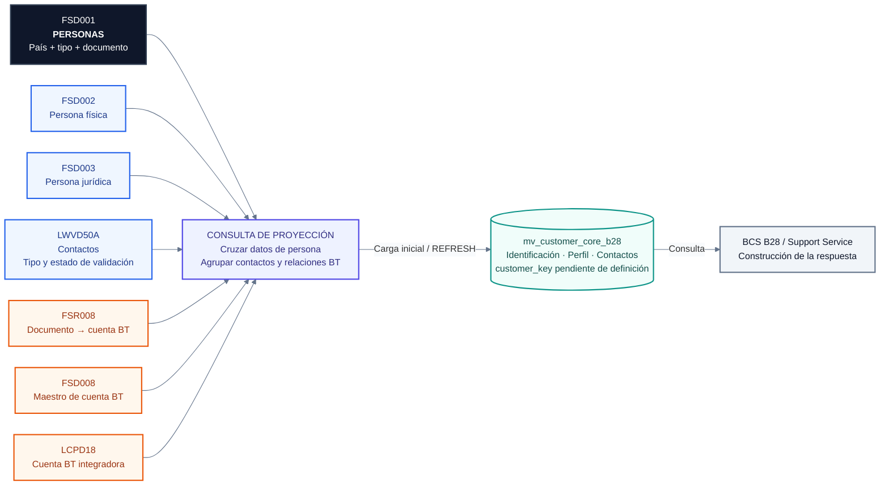

# Materialized View · Cliente B28 desde CORE

**Análisis del Excel «Mapeo Campos B28 - Tablas CORE (1).xlsx»**

El archivo permite proponer una vista materializada de **identificación, datos personales o jurídicos y contactos del cliente**. Identifica siete tablas CORE y quince columnas de salida. Contiene un mapeo y diccionarios de campos; no contiene datos de clientes, un DDL completo, claves declaradas ni una consulta SQL final.

Estas siete tablas son fuentes upstream utilizadas para construir la información B28. No son las tablas del consumer. El consumer recibe el JSON y usa el [modelo PostgreSQL de siete tablas de dominio](modelo-postgresql-json-7-tablas.md).

## 1. Las siete tablas del archivo

| Tabla CORE | Función documentada | Uso propuesto en la vista |
|---|---|---|
| `FSD001` | Personas | Base de la consulta: país, tipo y número de documento, tipo de persona. |
| `FSD002` | Persona física | Nombres, apellidos, sexo, nacimiento y estado civil. |
| `FSD003` | Persona jurídica | Razón social y fecha de constitución. |
| `LWVD50A` | Clave digital | Datos de contacto, tipo de contacto y estado de validación. |
| `FSR008` | Relación documento–cuenta BT | Vínculo de una persona con empresa/cuenta BT. |
| `FSD008` | Cuenta BT | Datos maestros de la cuenta BT. |
| `LCPD18` | Cuenta BT integradora | Relación entre empresa/cuenta BT y empresa/cuenta BT única. |

**Fuente:** `TABLAS CORE!D2:E8`; diccionarios de `Materialized View!A12:W45`. La descripción inicial de FSD008 indica «Pendiente validar», aunque la hoja Materialized View sí incluye su diccionario.

## 2. Diagrama de la vista propuesta

El diagrama representa la dependencia de datos. Las siete tablas deben existir en PostgreSQL con datos replicados antes de crear la vista; el Excel no demuestra que esa réplica esté implementada. Las tablas BT aportan la resolución de identidad/cuenta, no los permisos ACH del payload anterior.

## 3. Las quince columnas de salida

La hoja `Materialized View!A1:O1` define exactamente estas columnas:

| Columna | Origen propuesto | Estado del mapeo |
|---|---|---|
| `customer_key` | `FSD001.Pecuebt`, o resolución BT por definir | Response lo asigna a Pecuebt; ese campo no aparece en el diccionario y las notas anuncian una futura adición. No sustituirlo por Ctnro o CPD18CTUNI sin acuerdo. |
| `customer_type` | `FSD001.Petipo` → catálogo PN/PJ | La salida PN/PJ está acordada en el Excel, pero falta la equivalencia de los códigos CORE de un carácter. |
| `identification_no` | `FSD001.Pendoc` como identidad base; contrastar con `LWVD50A.WV50ANDOC` | Response propone LWVD50A y admite varias fuentes. Usar FSD001 como base es una decisión de diseño para conservar personas sin contacto digital. |
| `identification_type` | `FSD001.Petdoc`; contrastar con `WV50ATDOC` | Conservar código CORE hasta acordar el catálogo de respuesta. No convertir un código a “passport” por el ejemplo JSON. |
| `email` | `LWVD50A.WV50ADCON`, cuando `WV50ATDAT = '1'` | Inferido del diccionario. Para contacto validado, añadir `WV50AEST = '1'`. |
| `phone` | `LWVD50A.WV50ADCON`, cuando `WV50ATDAT = '2'` | Coincide con Request y notas. Response contiene un cruce contradictorio. |
| `full_name` | Concatenación de `Pfnom1`, `Pfnom2`, `Pfape1`, `Pfape2` | Derivado. El Excel propone que lo construya el support service si la lógica es ligera; acordar si se mueve a la vista. |
| `first_given_name` | `FSD002.Pfnom1` | Documentado. |
| `second_given_name` | `FSD002.Pfnom2` | Documentado. |
| `first_last_name` | `FSD002.Pfape1` | Documentado. |
| `second_last_name` | `FSD002.Pfape2` | Documentado. |
| `sex_type` | `FSD002.Pfcant` | Documentado como Sexo; falta catálogo para traducir códigos. |
| `birth_date` | `FSD002.Pffnac` | Documentado como tipo D, longitud 8; falta el formato físico de la réplica y la regla para fechas vacías o inválidas. |
| `legal_name` | `FSD003.Pjrazs` | Documentado. |
| `country_code` | `LWVD50A.WV50APAIS` en Response | Es el país de la identificación/contacto en el cruce. No asumir país de residencia ni convertir automáticamente a código ISO de dos letras. |

**Fuentes:** `Mapeo Campos Response!C5:F19`, `C22:F28`, `C40:E40`, `C47:F52`; `Materialized View!A14:W23`; `TABLAS CORE!E2`.

Para los campos añadidos a tu payload anterior hay dos fuentes adicionales claras en el diccionario: **estado civil → FSD002.Pfeciv** y **fecha de constitución → FSD003.Pjfcon**. Su formato y catálogo requieren validación. `person_type` podría derivarse de Petipo únicamente tras confirmar el significado esperado de ese campo; no equivale automáticamente al valor libre del ejemplo.

## 4. Cruces candidatos entre tablas

Los siguientes cruces se deducen de nombres, tipos y descripciones coincidentes. El archivo no declara PK/FK ni cardinalidades, por lo que deben contrastarse con el DDL y datos reales.

| Desde | Hacia | Condición candidata |
|---|---|---|
| FSD001 | FSD002 | `Pepais = Pfpais AND Petdoc = Pftdoc AND Pendoc = Pfndoc` |
| FSD001 | FSD003 | `Pepais = Pjpais AND Petdoc = Pjtdoc AND Pendoc = Pjndoc` |
| FSD001 | LWVD50A | `Pepais = WV50APAIS AND Petdoc = WV50ATDOC AND Pendoc = WV50ANDOC` |
| FSD001 | FSR008 | `Pepais = Pepais AND Petdoc = Petdoc AND Pendoc = Pendoc`, usando alias distintos |
| FSR008 | FSD008 | `Pgcod = PGCOD AND Ctnro = CTNRO` |
| FSR008 | LCPD18 | `Pgcod = CPD18PGCOD AND Ctnro = CPD18CTNRO` |

En FSD003, el diccionario escribe `*Pjpais`, `*Pjtdoc`, `*Pjndoc`. Debe confirmarse que el asterisco sea una marca del documento y no parte del identificador físico. Para LCPD18, la dirección propuesta usa el lado “Cuenta BT” y expone el lado “Cuenta BT Única”; el significado de `CPD17CODRE` y el sentido funcional de la relación siguen pendientes.

### Granularidad recomendada para iniciar

**Una fila por `(país del documento, tipo de documento, número de documento)`.** Es una propuesta basada en los campos comunes, no una clave primaria comprobada.

Si negocio decide que el registro representa una cuenta BT por empresa, la granularidad deberá incorporar `Pgcod + Ctnro`, o la identidad integrada que se acuerde. No se debe imponer un índice único en `customer_key` antes de resolver esa decisión.

Hay dos relaciones potencialmente múltiples: contactos y cuentas BT. Se deben agrupar por persona **antes** de unirlas al perfil. Un JOIN directo de dos contactos y tres relaciones BT genera seis filas y puede duplicar al cliente.

## 5. Inconsistencias y vacíos concretos

| Hallazgo | Evidencia en el archivo | Tratamiento propuesto |
|---|---|---|
| Teléfono apuntado a un discriminador | Response `D48 = WV50ATDAT`; Request `F6 = WV50ADCON` | Tomar el valor de WV50ADCON; usar WV50ATDAT solo para distinguir email/celular. |
| Tipo de contacto apuntado a estado de validación | Response `D47 = WV50AEST`; diccionario `W19 = 0 pendiente / 1 validado` | Mantener tipo y validación separados. El estado 0/1 no equivale a “Cell”. |
| Customer key aún incompleto | Response `D5 = Pecuebt`; `TABLAS CORE!E2` anuncia una nueva cuenta BT en FSD001 | Confirmar si Pecuebt ya existe, su DDL, población y precedencia frente a FSR008/LCPD18. |
| PN/PJ frente a un campo CORE de longitud 1 | `Materialized View!A17:C17` y `Mapeo Campos Response!M11` | Acordar tabla de equivalencias, incluidos códigos inesperados. |
| Email sin fuente en el mapeo Response | `Mapeo Campos Response!C52:E52` | Proponer WV50ADCON con tipo 1 a partir del diccionario; confirmar regla de selección. |
| Fechas sin formato de réplica | `Materialized View!G21:K21`, `M18:Q18` | Confirmar si llegan como DATE, texto o número y cómo se representan fechas no informadas. |
| Unicidad sin prueba | El Excel describe columnas; no incluye restricciones ni filas reales | Validar duplicados de persona, subtipo y contacto antes de decidir índices y selección de datos. |
| Acceso TAPP incompleto | `TABLAS CORE!D25`, `D33`, `D41` | La ausencia en LWVD50A se asocia con falta de acceso, pero no está resuelto el caso de solo email frente a un flujo que busca por celular. |

El Excel indica que el cliente tiene un correo en CORE (`Mapeo Campos Response!M13`), pero esto no demuestra que LWVD50A no tenga registros históricos, repetidos o de distintos estados. Si hay varios contactos validados distintos, la vista debe exponer la ambigüedad o aplicar una regla acordada; `MAX(email)` no selecciona el contacto vigente por sí solo.

## 6. Qué puede obtenerse del payload anterior

| Parte del payload | Cobertura de estas fuentes |
|---|---|
| Documento, nombres, sexo, nacimiento, estado civil | Existe mapeo o campo CORE candidato. |
| Teléfono y email validados | Existe origen en LWVD50A con las correcciones indicadas. |
| Razón social y fecha de constitución | Existen en FSD003 para la persona jurídica. |
| Identidad del usuario de la aplicación y su pertenencia a una empresa | No están demostradas por el mapeo CORE. Una persona física no queda vinculada a una persona jurídica por compartir una cuenta sin una regla de negocio explícita. |
| `triggering_user_details` | Depende del actor de la petición/evento; no puede deducirse de una vista estática de clientes. |
| Servicios ACH, roles CREATOR/Administrator, selección y permisos | No están mapeados en estas siete tablas. |
| Límites transaccionales/diarios de usuario–servicio–cuenta | No están mapeados. |

Una **cuenta BT** no debe equipararse automáticamente con `accounts[].account_number` del payload de permisos. Tampoco `Pgcod` equivale por sí solo a `enterprise_sco_id`. El Excel no establece esas equivalencias.

El evento completo de usuario que se implementó antes tampoco contiene todos los campos necesarios para reconstruir siete réplicas CORE. Para alimentar esta arquitectura hay que definir el contrato CDC o la carga que mantendrá esas tablas.

## 7. Diseño recomendado de la vista

Nombre propuesto: **`read_model.mv_customer_core_b28`**.

La consulta debería organizarse en cuatro bloques:

1. **Persona base:** FSD001 y subtipos FSD002/FSD003 mediante LEFT JOIN; detectar ausencia o coexistencia inesperada de subtipos.
2. **Contactos:** agrupar LWVD50A por identidad documental, distinguir tipo 1/2 y estado 0/1, conservar indicadores de cantidad/ambigüedad.
3. **Relaciones BT:** agrupar FSR008 con FSD008 y LCPD18, preservando varias asociaciones hasta acordar la selección de customer_key.
4. **Proyección B28:** exponer las quince columnas, catálogos homologados y diagnósticos técnicos que la API no tiene por qué devolver.

Este análisis sirve para entender cómo el producer obtiene información upstream. El consumer no consulta esas tablas. Para el consumer del JSON, consultar el [modelo de siete tablas](modelo-postgresql-json-7-tablas.md), su [DDL](../scripts/postgresql/drafts/customer-json-7-table-schema.sql) y la [materialized view](../scripts/postgresql/drafts/customer-json-materialized-view.sql).

El borrador se probó en PostgreSQL 18 con tablas y datos sintéticos en una base aislada. Se verificaron el agrupamiento sin multiplicar personas, contactos duplicados y ambiguos, exclusión de contactos pendientes, varias relaciones BT, personas sin contacto, detección de subtipos duplicados y refresco concurrente. La transacción de prueba se revirtió. Esta prueba valida el comportamiento del SQL bajo los supuestos documentados; no valida las claves ni los códigos de la base CORE real.

### Actualización

La réplica CDC mantiene las tablas fuente. La vista necesita su propia carga inicial y un proceso de refresco; no se actualiza automáticamente al escribir en esas tablas. Para refrescos concurrentes, PostgreSQL exige que la vista ya esté poblada y tenga un índice UNIQUE sobre columnas que cubra todas las filas. [Referencia: REFRESH MATERIALIZED VIEW](https://www.postgresql.org/docs/current/sql-refreshmaterializedview.html).

La replicación lógica nativa de PostgreSQL no replica vistas materializadas. Por tanto, el tramo del diagrama anterior etiquetado “Logical Replication → Vista materializada” debe representar **replicar tablas y ejecutar el refresco en destino**, o sustituirse por un proceso explícito de proyección. [Referencia: restricciones de replicación lógica](https://www.postgresql.org/docs/current/logical-replication-restrictions.html).

El refresco debe ejecutarse después de una carga consistente de las siete fuentes. No corrige diferencias de avance del CDC entre tablas. Su periodicidad depende del retraso máximo permitido para la consulta B28; no se ha elegido un intervalo sin ese requisito.

## 8. Consultas precisas para cerrar el SQL

1. **Customer key:** ¿ya existe `FSD001.Pecuebt` y debe prevalecer sobre la cuenta BT de FSR008 o la cuenta BT única de LCPD18?
2. **Claves y relaciones:** ¿cuáles son las PK/UK reales de las siete tablas, y qué valores de CPD17CODRE/dirección de LCPD18 aplican?
3. **Catálogos y formatos:** ¿cómo se convierten Petipo a PN/PJ, tipo documental, sexo, estado civil, país y fechas de ocho posiciones?
4. **Contactos:** ¿solo estado validado 1, cómo se resuelven varios valores y qué ocurre con un cliente que tiene email pero no celular?
5. **Alcance de salida:** ¿la API necesita únicamente el perfil B28 o también los permisos del payload de usuario, que requieren otras fuentes?
6. **Frescura:** ¿cuánto retraso se permite entre un cambio CORE y su aparición en B28?

**Conclusión:** el Excel aporta una base concreta para la vista B28 y permite identificar sus siete fuentes. La definición final depende principalmente de la identidad `customer_key`, las relaciones BT y las reglas de homologación/contactos.
