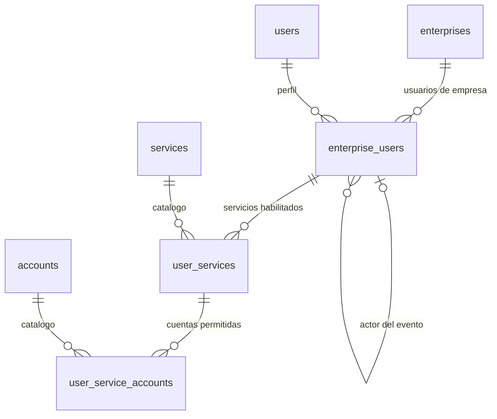

# Diagrama del customer consumer

El diagrama definitivo corresponde al modelo normalizado de siete tablas del esquema
`cdc_customer`:

La versión detallada, con columnas, reglas y mapeo JSON, está en
[modelo-postgresql-json-7-tablas.md](modelo-postgresql-json-7-tablas.md).
