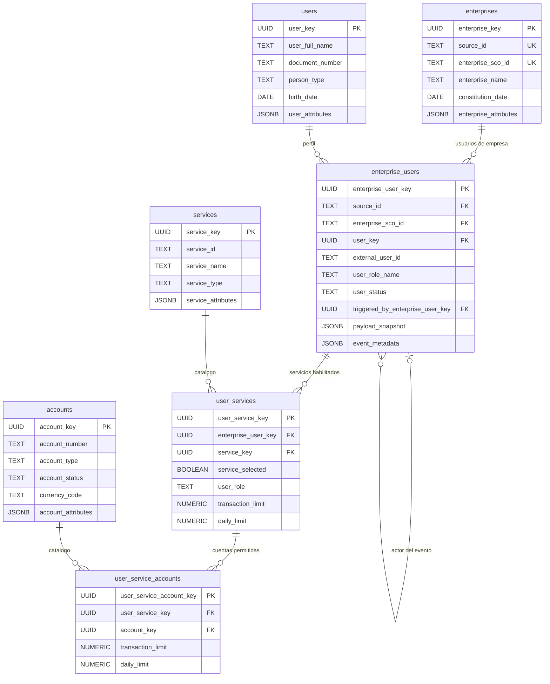

# Consumer del JSON · Modelo PostgreSQL de siete tablas

El consumer recibe el evento `CUSTOMER_INFORMATION_RETRIEVED`. Por eso sus tablas usan nombres del dominio del JSON y no los nombres físicos `FSD001`, `FSD002`, etc. del CORE.

## Modelo



## Nombres y origen JSON

| # | Tabla PostgreSQL | Origen del JSON | Responsabilidad |
|---:|---|---|---|
| 1 | `cdc_customer.enterprises` | `enterprise_details` | Empresa del usuario objetivo y empresa del actor. |
| 2 | `cdc_customer.users` | `user_details` / `triggering_user_details` | Perfil personal independiente de la empresa. |
| 3 | `cdc_customer.enterprise_users` | Usuario dentro de su empresa | `user_id`, rol, estado, permisos generales, actor y snapshot completo. |
| 4 | `cdc_customer.services` | `entitlements.services[]` | Catálogo de servicios observado en la empresa. |
| 5 | `cdc_customer.accounts` | `services[].accounts[]` | Catálogo de cuentas observado en la empresa. |
| 6 | `cdc_customer.user_services` | Servicio asignado al usuario | Selección, rol y límites del servicio. |
| 7 | `cdc_customer.user_service_accounts` | Cuenta dentro del servicio del usuario | Límites para la combinación usuario–servicio–cuenta. |

El DDL ejecutado por el consumer está en [schema.sql](../src/main/resources/schema.sql). También se entrega una copia para DBA en [customer-json-7-table-schema.sql](../scripts/postgresql/customer-json-7-table-schema.sql).

## Actor y usuario objetivo

`triggering_user_details.user_id = 54901` identifica al actor. `user_details.user_id = 55421` identifica al usuario cuyo estado completo se reemplaza.

Ambos se representan mediante `users` y `enterprise_users`. La columna `triggered_by_enterprise_user_key` enlaza al usuario objetivo con el actor. El bloque del actor es parcial, por lo que no reemplaza sus servicios ni borra datos que el evento no contiene.

## Payload dinámico

Los campos conocidos se proyectan a columnas. El JSON se conserva además en:

- `enterprise_attributes`, `user_attributes`, `service_attributes` y `account_attributes`.
- `entitlement_attributes` en las dos relaciones de permisos.
- `payload_snapshot` y `event_metadata` para conservar el evento completo.

Así, un campo futuro no se pierde aunque todavía no tenga una columna dedicada.

## Materialized view

La vista materializada se llama:

```text
cdc_customer.mv_customer_information_profiles
```

Se deriva de las siete tablas y reconstruye servicios y cuentas como JSON para lectura. Su SQL está en [create-customer-profiles-view.sql](../scripts/postgresql/create-customer-profiles-view.sql).

```sql
REFRESH MATERIALIZED VIEW CONCURRENTLY
    cdc_customer.mv_customer_information_profiles;
```

La materialized view es un objeto derivado; no constituye una octava tabla del dominio.

## Aplicación del snapshot completo

Cuando llega un evento más reciente para el usuario objetivo:

1. Se actualizan empresa, perfil y relación usuario–empresa.
2. Se resuelven o crean los catálogos de servicios y cuentas.
3. Se reemplazan solamente sus filas en `user_services` y `user_service_accounts`.
4. Todo se confirma en una única transacción.

`services: []` elimina los permisos del usuario, pero conserva los catálogos compartidos. `accounts: []` conserva el servicio sin cuentas habilitadas.
