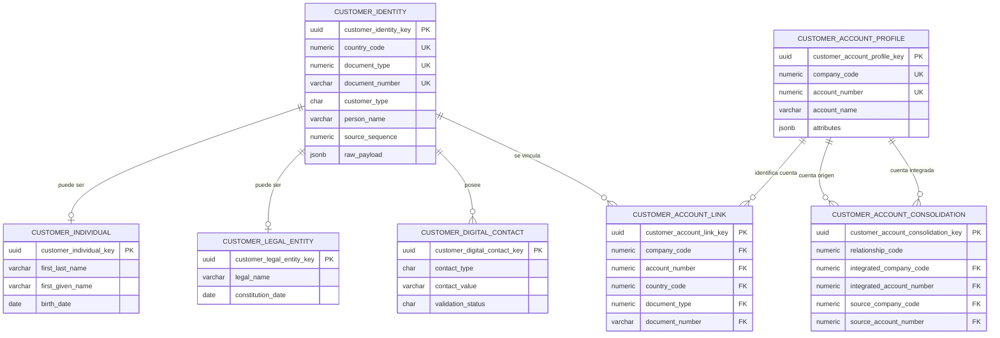

# Modelo PostgreSQL de siete tablas

## Relación con CORE

| CORE | PostgreSQL | Sección JSON |
|---|---|---|
| FSD001 | `customer_identity` | `customer_identity` |
| FSD002 | `customer_individual` | `individual_profile` |
| FSD003 | `customer_legal_entity` | `legal_entity_profile` |
| LWVD50A | `customer_digital_contact` | `digital_contacts[]` |
| FSD008 | `customer_account_profile` | `account_profiles[]` |
| FSR008 | `customer_account_link` | `customer_account_links[]` |
| LCPD18 | `customer_account_consolidation` | `account_consolidations[]` |

Las claves UUID son técnicas para Spring Data. La equivalencia funcional se protege con
restricciones `UNIQUE` compuestas y claves foráneas sobre país, tipo y número de documento
o sobre empresa y número de cuenta.

Cada sección conserva campos adicionales en `JSONB`. La tabla de identidad también
conserva el payload y metadata completos.
