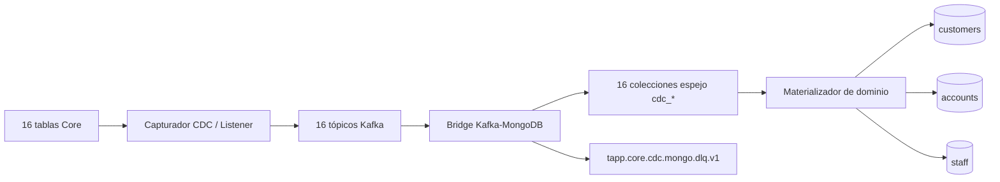

# Arquitectura CDC para 16 tablas Core, Kafka y MongoDB

**Estado:** propuesta técnica para validación  
**Fuente funcional:** `Diccionario_Tablas_TAPP.xlsx`  
**Alcance:** publicación de cambios de 16 tablas del Core en Kafka y persistencia individual en MongoDB.

## 1. Objetivo

La solución debe transportar hacia MongoDB los cambios de las 16 tablas identificadas en el diccionario de datos. Para mantener trazabilidad, aislar la evolución de los esquemas y permitir reconstrucciones independientes, se propone una relación uno a uno:

```text
Tabla Core -> Tópico CDC -> Colección MongoDB
```

La propuesta utiliza:

- 16 tópicos principales, uno por tabla.
- 16 colecciones espejo en MongoDB.
- Una clave Kafka igual al `_id` del documento MongoDB.
- Un sobre de evento común para todas las tablas.
- Una DLQ compartida para errores permanentes del bridge.
- Metadatos CDC en cada documento para controlar orden, duplicados y trazabilidad.

Las claves primarias propuestas deben validarse con el equipo propietario del Core. El diccionario describe los campos, pero no identifica formalmente todas las claves primarias, restricciones de unicidad ni secuencias de actualización.

## 2. Arquitectura



Las colecciones `cdc_*` representan fielmente el estado de cada tabla. Las colecciones consolidadas son opcionales, pero recomendables para impedir que una API tenga que consultar y unir varias colecciones en cada solicitud.

## 3. Convención de nombres

### 3.1 Tópicos

```text
tapp.core.cdc.<tabla-en-minusculas>.v1
```

Ejemplo:

```text
tapp.core.cdc.fsd001.v1
```

### 3.2 Colecciones

```text
cdc_<tabla-en-minusculas>_<descripcion>
```

Ejemplo:

```text
cdc_fsd001_persons
```

### 3.3 Claves protegidas

Los números de documento, cuenta, teléfono o correo no deben utilizarse directamente como Kafka key ni como `_id`. Se deben transformar mediante tokenización determinística o HMAC administrado por un componente autorizado.

Referencias sugeridas:

```text
customerRef  = HMAC(countryCode|documentType|documentNumber)
accountRef   = HMAC(companyCode|accountNumber)
staffRef     = HMAC(employeeCode)
dataHash     = HMAC(contactType|contactValue)
```

El mismo algoritmo y versión de clave deben utilizarse en todas las tablas que representen la misma entidad.

## 4. Contrato común del evento Kafka

Kafka key:

```text
Igual a payload.entity_id y al _id del documento MongoDB
```

Value:

```json
{
  "payload": {
    "operation": "SNAPSHOT|INSERT|UPDATE|DELETE",
    "entity_id": "identificador-estable-del-registro",
    "before": null,
    "after": {}
  },
  "metadata": {
    "event_id": "JRN-98457321",
    "schema_version": "1.0",
    "source_system": "TAPP_CORE",
    "source_table": "FSD001",
    "source_position": "JRN001:98457321",
    "source_transaction_id": "CORE-TX-8891",
    "source_commit_at": "2026-09-04T19:30:00Z",
    "captured_at": "2026-09-04T19:30:00.500Z",
    "published_at": "2026-09-04T19:30:01Z"
  }
}
```

Reglas:

1. `entity_id` es obligatorio.
2. La Kafka key debe ser exactamente `entity_id`.
3. `event_id` debe ser globalmente único.
4. `source_position` debe permitir comparar el orden de los cambios.
5. Para `DELETE`, `after` debe ser `null` y `before` debe contener la última imagen disponible.
6. Para `SNAPSHOT`, `before` debe ser `null`.
7. Los timestamps se expresan en UTC con formato ISO 8601.
8. Los cambios de estructura incompatibles requieren una nueva versión mayor del esquema.

## 5. Metadatos comunes en MongoDB

Cada colección debe conservar los campos funcionales y un bloque técnico `_cdc`:

```json
{
  "_id": "identificador-estable-del-registro",
  "deleted": false,
  "_cdc": {
    "source_table": "FSD001",
    "event_id": "JRN-98457321",
    "source_position": "JRN001:98457321",
    "source_transaction_id": "CORE-TX-8891",
    "schema_version": "1.0",
    "source_commit_at": "2026-09-04T19:30:00Z",
    "processed_at": "2026-09-04T19:30:01.250Z",
    "topic": "tapp.core.cdc.fsd001.v1",
    "partition": 0,
    "offset": 8922
  }
}
```

La escritura debe aceptar el evento únicamente cuando su `source_position` sea posterior a la almacenada. Un `event_id` repetido se clasifica como duplicado y no vuelve a modificar el documento.

## 6. Inventario general

| N.° | Tabla | Tópico Kafka | Colección MongoDB | `_id` propuesto |
|---:|---|---|---|---|
| 1 | `FSD001` | `tapp.core.cdc.fsd001.v1` | `cdc_fsd001_persons` | `customerRef` |
| 2 | `FSD002` | `tapp.core.cdc.fsd002.v1` | `cdc_fsd002_natural_persons` | `customerRef` |
| 3 | `FSD003` | `tapp.core.cdc.fsd003.v1` | `cdc_fsd003_legal_persons` | `customerRef` |
| 4 | `FSR008` | `tapp.core.cdc.fsr008.v1` | `cdc_fsr008_customer_accounts` | `customerRef|accountRef` |
| 5 | `LCPD18` | `tapp.core.cdc.lcpd18.v1` | `cdc_lcpd18_integrated_accounts` | `integratedAccountRef|accountRef` |
| 6 | `LWVD50A` | `tapp.core.cdc.lwvd50a.v1` | `cdc_lwvd50a_digital_keys` | `customerRef|dataType|dataHash` |
| 7 | `FSD005` | `tapp.core.cdc.fsd005.v1` | `cdc_fsd005_addresses` | `customerRef|addressCode` |
| 8 | `FSR005` | `tapp.core.cdc.fsr005.v1` | `cdc_fsr005_unverified_phones` | `customerRef|dataCode|order` |
| 9 | `D11008` | `tapp.core.cdc.d11008.v1` | `cdc_d11008_customer_segments` | `accountRef` |
| 10 | `LCPD15I` | `tapp.core.cdc.lcpd15i.v1` | `cdc_lcpd15i_address_details` | `customerRef|addressCode` |
| 11 | `FST013` | `tapp.core.cdc.fst013.v1` | `cdc_fst013_countries` | `countryCode` |
| 12 | `LWFT05` | `tapp.core.cdc.lwft05.v1` | `cdc_lwft05_application_users` | `applicationCode|applicationUser` |
| 13 | `F5D008` | `tapp.core.cdc.f5d008.v1` | `cdc_f5d008_account_executives` | `accountRef` |
| 14 | `F5T010` | `tapp.core.cdc.f5t010.v1` | `cdc_f5t010_executives` | `companyCode|executiveCode` |
| 15 | `F5T146` | `tapp.core.cdc.f5t146.v1` | `cdc_f5t146_user_executives` | `companyCode|btUser` |
| 16 | `LAPD05` | `tapp.core.cdc.lapd05.v1` | `cdc_lapd05_workers` | `staffRef` |

## 7. Definición por tabla

### 7.1 FSD001 - Personas

| Propiedad | Valor |
|---|---|
| Tópico | `tapp.core.cdc.fsd001.v1` |
| Colección | `cdc_fsd001_persons` |
| Kafka key / `_id` | `customerRef` |
| Clave fuente propuesta | `Pepais|Petdoc|Pendoc` |

Mapeo:

| Campo fuente | Campo MongoDB |
|---|---|
| `Pepais` | `country_code` |
| `Petdoc` | `document_type` |
| `Pendoc` | `document_reference` |
| `Petipo` | `person_type` |
| `Penom` | `full_name` |

Ejemplo:

```json
{
  "_id": "cus_83a92...",
  "country_code": 604,
  "document_type": 1,
  "document_reference": "doc_a72f...",
  "person_type": "N",
  "full_name": "JUAN PEREZ",
  "deleted": false,
  "_cdc": {}
}
```

### 7.2 FSD002 - Persona física

| Propiedad | Valor |
|---|---|
| Tópico | `tapp.core.cdc.fsd002.v1` |
| Colección | `cdc_fsd002_natural_persons` |
| Kafka key / `_id` | `customerRef` |
| Clave fuente propuesta | `Pfpais|Pftdoc|Pfndoc` |

Mapeo:

| Campo fuente | Campo MongoDB |
|---|---|
| `Pfpais` | `country_code` |
| `Pftdoc` | `document_type` |
| `Pfndoc` | `document_reference` |
| `Pfape1` | `paternal_surname` |
| `Pfape2` | `maternal_surname` |
| `Pfnom1` | `first_name` |
| `Pfnom2` | `second_name` |
| `Pffnac` | `birth_date` |
| `Pfeciv` | `marital_status` |
| `Pfcant` | `sex` |

Ejemplo:

```json
{
  "_id": "cus_83a92...",
  "country_code": 604,
  "document_type": 1,
  "document_reference": "doc_a72f...",
  "paternal_surname": "PEREZ",
  "maternal_surname": "LOPEZ",
  "first_name": "JUAN",
  "second_name": "CARLOS",
  "birth_date": "1990-05-12",
  "marital_status": "S",
  "sex": "M",
  "deleted": false,
  "_cdc": {}
}
```

### 7.3 FSD003 - Persona jurídica

| Propiedad | Valor |
|---|---|
| Tópico | `tapp.core.cdc.fsd003.v1` |
| Colección | `cdc_fsd003_legal_persons` |
| Kafka key / `_id` | `customerRef` |
| Clave fuente propuesta | `Pjpais|Pjtdoc|Pjndoc` |

Mapeo:

| Campo fuente | Campo MongoDB |
|---|---|
| `Pjpais` | `country_code` |
| `Pjtdoc` | `document_type` |
| `Pjndoc` | `document_reference` |
| `Pjrazs` | `legal_name` |
| `Pjfcon` | `incorporation_date` |

Ejemplo:

```json
{
  "_id": "cus_529bd...",
  "country_code": 604,
  "document_type": 6,
  "document_reference": "doc_d981...",
  "legal_name": "EMPRESA EJEMPLO SAC",
  "incorporation_date": "2015-08-21",
  "deleted": false,
  "_cdc": {}
}
```

### 7.4 FSR008 - Relación documento y cuenta BT

| Propiedad | Valor |
|---|---|
| Tópico | `tapp.core.cdc.fsr008.v1` |
| Colección | `cdc_fsr008_customer_accounts` |
| Kafka key / `_id` | `customerRef|accountRef` |
| Clave fuente propuesta | `Pgcod|Ctnro|Pepais|Petdoc|Pendoc` |

Mapeo:

| Campo fuente | Campo MongoDB |
|---|---|
| `Pgcod` | `company_code` |
| `Ctnro` | `account_reference` |
| `Pepais|Petdoc|Pendoc` | `customer_reference` |

Ejemplo:

```json
{
  "_id": "cus_83a92...|acc_c218...",
  "company_code": 1,
  "account_reference": "acc_c218...",
  "customer_reference": "cus_83a92...",
  "deleted": false,
  "_cdc": {}
}
```

### 7.5 LCPD18 - Cuenta BT integradora

| Propiedad | Valor |
|---|---|
| Tópico | `tapp.core.cdc.lcpd18.v1` |
| Colección | `cdc_lcpd18_integrated_accounts` |
| Kafka key / `_id` | `integratedAccountRef|accountRef` |
| Clave fuente propuesta | Relación entre cuenta única y cuenta miembro |

Mapeo:

| Campo fuente | Campo MongoDB |
|---|---|
| `CPD17CODRE` | `relation_code` |
| `CPD18PGUNI` | `integrated_company_code` |
| `CPD18CTUNI` | `integrated_account_reference` |
| `CPD18PGCOD` | `member_company_code` |
| `CPD18CTNRO` | `member_account_reference` |

Ejemplo:

```json
{
  "_id": "acc_uni_91ac...|acc_c218...",
  "relation_code": 1,
  "integrated_company_code": 1,
  "integrated_account_reference": "acc_uni_91ac...",
  "member_company_code": 1,
  "member_account_reference": "acc_c218...",
  "deleted": false,
  "_cdc": {}
}
```

### 7.6 LWVD50A - Clave digital

| Propiedad | Valor |
|---|---|
| Tópico | `tapp.core.cdc.lwvd50a.v1` |
| Colección | `cdc_lwvd50a_digital_keys` |
| Kafka key / `_id` | `customerRef|dataType|dataHash` |
| Clave fuente propuesta | Cliente, tipo de dato y hash del dato |

Mapeo:

| Campo fuente | Campo MongoDB |
|---|---|
| `WV50APAIS|WV50ATDOC|WV50ANDOC` | `customer_reference` |
| `WV50ATDAT` | `data_type` |
| `WV50ADCON` | `protected_value` |
| `WV50AEST` | `status` |

`WV50ADCON` puede contener correo o celular. El valor debe cifrarse, tokenizarse o enmascararse antes de publicarse.

Ejemplo:

```json
{
  "_id": "cus_83a92...|EMAIL|b79d...",
  "customer_reference": "cus_83a92...",
  "data_type": "EMAIL",
  "protected_value": "email_b79d...",
  "status": "VALIDATED",
  "deleted": false,
  "_cdc": {}
}
```

### 7.7 FSD005 - Domicilio de personas

| Propiedad | Valor |
|---|---|
| Tópico | `tapp.core.cdc.fsd005.v1` |
| Colección | `cdc_fsd005_addresses` |
| Kafka key / `_id` | `customerRef|addressCode` |
| Clave fuente propuesta | `Pepais|Petdoc|Pendoc|Docod` |

Mapeo:

| Campo fuente | Campo MongoDB |
|---|---|
| `Pepais|Petdoc|Pendoc` | `customer_reference` |
| `Docod` | `address_code` |
| `Docallp` | `address_line` |
| `Dociudp` | `city` |
| `Dopaisp` | `address_country_code` |
| `Docposp` | `postal_code` |

Ejemplo:

```json
{
  "_id": "cus_83a92...|01",
  "customer_reference": "cus_83a92...",
  "address_code": 1,
  "address_line": "AV. EJEMPLO 123",
  "city": "LIMA",
  "address_country_code": 604,
  "postal_code": "15001",
  "deleted": false,
  "_cdc": {}
}
```

### 7.8 FSR005 - Celulares no verificados

| Propiedad | Valor |
|---|---|
| Tópico | `tapp.core.cdc.fsr005.v1` |
| Colección | `cdc_fsr005_unverified_phones` |
| Kafka key / `_id` | `customerRef|dataCode|order` |
| Clave fuente propuesta | `Pepais|Petdoc|Pendoc|Docod|Doordp` |

Mapeo:

| Campo fuente | Campo MongoDB |
|---|---|
| `Pepais|Petdoc|Pendoc` | `customer_reference` |
| `Docod` | `data_code` |
| `Doordp` | `order` |
| `Dotelfp` | `protected_phone` |

Ejemplo:

```json
{
  "_id": "cus_83a92...|01|01",
  "customer_reference": "cus_83a92...",
  "data_code": 1,
  "order": 1,
  "protected_phone": "tel_72ad...",
  "verification_status": "UNVERIFIED",
  "deleted": false,
  "_cdc": {}
}
```

### 7.9 D11008 - Segmento del cliente

| Propiedad | Valor |
|---|---|
| Tópico | `tapp.core.cdc.d11008.v1` |
| Colección | `cdc_d11008_customer_segments` |
| Kafka key / `_id` | `accountRef` |
| Clave fuente propuesta | `D11008pgco|D11008ctnr` |

Mapeo:

| Campo fuente | Campo MongoDB |
|---|---|
| `D11008pgco` | `company_code` |
| `D11008ctnr` | `account_reference` |
| `D11008segc` | `segment_code` |

Se debe confirmar si el segmento pertenece funcionalmente a la cuenta o al cliente. El diccionario lo denomina “Segmento Cliente”, pero la clave disponible utiliza empresa y cuenta.

Ejemplo:

```json
{
  "_id": "acc_c218...",
  "company_code": 1,
  "account_reference": "acc_c218...",
  "segment_code": 5,
  "deleted": false,
  "_cdc": {}
}
```

### 7.10 LCPD15I - Extensión de dirección

| Propiedad | Valor |
|---|---|
| Tópico | `tapp.core.cdc.lcpd15i.v1` |
| Colección | `cdc_lcpd15i_address_details` |
| Kafka key / `_id` | `customerRef|addressCode` |
| Clave fuente propuesta | País, tipo de documento, documento y código de dirección |

Mapeo:

| Campo fuente | Campo MongoDB |
|---|---|
| `Cpd15ipdoc|Cpd15itdoc|Cpd15indoc` | `customer_reference` |
| `Cpd15idcod` | `address_code` |
| `Cpd15inume` | `number` |
| `Cpd15idpto` | `apartment` |
| `Cpd15iofic` | `office` |
| `Cpd15ipiso` | `floor` |
| `Cpd15imzna` | `block` |
| `Cpd15ilote` | `lot` |
| `Cpd15iinte` | `interior` |
| `Cpd15isecc` | `sector` |
| `Cpd15ikilm` | `kilometer` |

Ejemplo:

```json
{
  "_id": "cus_83a92...|01",
  "customer_reference": "cus_83a92...",
  "address_code": 1,
  "number": "123",
  "apartment": "402",
  "office": null,
  "floor": "4",
  "block": null,
  "lot": null,
  "interior": null,
  "sector": null,
  "kilometer": null,
  "deleted": false,
  "_cdc": {}
}
```

### 7.11 FST013 - Países

| Propiedad | Valor |
|---|---|
| Tópico | `tapp.core.cdc.fst013.v1` |
| Colección | `cdc_fst013_countries` |
| Kafka key / `_id` | `countryCode` |
| Clave fuente propuesta | `Pais` |

Mapeo:

| Campo fuente | Campo MongoDB |
|---|---|
| `Pais` | `country_code` |
| `Panom` | `country_name` |

Ejemplo:

```json
{
  "_id": "604",
  "country_code": 604,
  "country_name": "PERU",
  "deleted": false,
  "_cdc": {}
}
```

### 7.12 LWFT05 - Usuarios STS y BT

| Propiedad | Valor |
|---|---|
| Tópico | `tapp.core.cdc.lwft05.v1` |
| Colección | `cdc_lwft05_application_users` |
| Kafka key / `_id` | `applicationCode|applicationUser` |
| Clave fuente propuesta | `Wf01acod|Wf05usr` |

Mapeo:

| Campo fuente | Campo MongoDB |
|---|---|
| `Wf01acod` | `application_code` |
| `Wf05usr` | `application_user` |
| `Wf05usrbt` | `bt_user` |

Ejemplo:

```json
{
  "_id": "APP|USR001",
  "application_code": "APP",
  "application_user": "USR001",
  "bt_user": "BTUSR01",
  "deleted": false,
  "_cdc": {}
}
```

### 7.13 F5D008 - Cuenta y ejecutivo

| Propiedad | Valor |
|---|---|
| Tópico | `tapp.core.cdc.f5d008.v1` |
| Colección | `cdc_f5d008_account_executives` |
| Kafka key / `_id` | `accountRef` |
| Clave fuente propuesta | `Pgcod|Ctnro5` |

Mapeo:

| Campo fuente | Campo MongoDB |
|---|---|
| `Pgcod` | `company_code` |
| `Ctnro5` | `account_reference` |
| `Cteject5` | `executive_reference` |

El título interno de la hoja debe validarse porque aparece como `LWFT05`, aunque los campos representan una relación cuenta-ejecutivo.

Ejemplo:

```json
{
  "_id": "acc_c218...",
  "company_code": 1,
  "account_reference": "acc_c218...",
  "executive_reference": "exec_00452",
  "deleted": false,
  "_cdc": {}
}
```

### 7.14 F5T010 - Maestro de ejecutivos

| Propiedad | Valor |
|---|---|
| Tópico | `tapp.core.cdc.f5t010.v1` |
| Colección | `cdc_f5t010_executives` |
| Kafka key / `_id` | `companyCode|executiveCode` |
| Clave fuente propuesta | `Pgcod|Ejcod5` |

Mapeo:

| Campo fuente | Campo MongoDB |
|---|---|
| `Pgcod` | `company_code` |
| `Ejcod5` | `executive_code` |
| `Ejnom5` | `executive_name` |

Ejemplo:

```json
{
  "_id": "001|00452",
  "company_code": 1,
  "executive_code": 452,
  "executive_name": "MARIA GARCIA",
  "deleted": false,
  "_cdc": {}
}
```

### 7.15 F5T146 - Usuario BT y ejecutivo

| Propiedad | Valor |
|---|---|
| Tópico | `tapp.core.cdc.f5t146.v1` |
| Colección | `cdc_f5t146_user_executives` |
| Kafka key / `_id` | `companyCode|btUser` |
| Clave fuente propuesta | `Pgcod|Ubuser` |

Mapeo:

| Campo fuente | Campo MongoDB |
|---|---|
| `Pgcod` | `company_code` |
| `Ubuser` | `bt_user` |
| `Ejcod5` | `executive_code` |

Ejemplo:

```json
{
  "_id": "001|BTUSR01",
  "company_code": 1,
  "bt_user": "BTUSR01",
  "executive_code": 452,
  "deleted": false,
  "_cdc": {}
}
```

### 7.16 LAPD05 - Trabajadores

| Propiedad | Valor |
|---|---|
| Tópico | `tapp.core.cdc.lapd05.v1` |
| Colección | `cdc_lapd05_workers` |
| Kafka key / `_id` | `staffRef` |
| Clave fuente propuesta | `Codemp` tokenizado |

Mapeo:

| Campo fuente | Campo MongoDB |
|---|---|
| `Codemp` | `employee_reference` |
| `Appate` | `paternal_surname` |
| `Apmate` | `maternal_surname` |
| `Nomb` | `given_names` |

Ejemplo:

```json
{
  "_id": "emp_00001234",
  "employee_reference": "emp_00001234",
  "paternal_surname": "GARCIA",
  "maternal_surname": "LOPEZ",
  "given_names": "MARIA ELENA",
  "deleted": false,
  "_cdc": {}
}
```

Los nombres de trabajadores son datos personales. La colección y el tópico requieren ACL restrictiva.

## 8. Configuración propuesta del bridge

El bridge puede utilizar una configuración externa con 16 rutas:

```yaml
bridge:
  deadLetterTopic: tapp.core.cdc.mongo.dlq.v1

  routes:
    - sourceTable: FSD001
      topic: tapp.core.cdc.fsd001.v1
      collection: cdc_fsd001_persons
      keyStrategy: CUSTOMER_REFERENCE

    - sourceTable: FSD002
      topic: tapp.core.cdc.fsd002.v1
      collection: cdc_fsd002_natural_persons
      keyStrategy: CUSTOMER_REFERENCE

    - sourceTable: FSD003
      topic: tapp.core.cdc.fsd003.v1
      collection: cdc_fsd003_legal_persons
      keyStrategy: CUSTOMER_REFERENCE

    - sourceTable: FSR008
      topic: tapp.core.cdc.fsr008.v1
      collection: cdc_fsr008_customer_accounts
      keyStrategy: CUSTOMER_ACCOUNT_REFERENCE

    - sourceTable: LCPD18
      topic: tapp.core.cdc.lcpd18.v1
      collection: cdc_lcpd18_integrated_accounts
      keyStrategy: INTEGRATED_ACCOUNT_RELATION_REFERENCE

    - sourceTable: LWVD50A
      topic: tapp.core.cdc.lwvd50a.v1
      collection: cdc_lwvd50a_digital_keys
      keyStrategy: CUSTOMER_DIGITAL_DATA_REFERENCE

    - sourceTable: FSD005
      topic: tapp.core.cdc.fsd005.v1
      collection: cdc_fsd005_addresses
      keyStrategy: CUSTOMER_ADDRESS_REFERENCE

    - sourceTable: FSR005
      topic: tapp.core.cdc.fsr005.v1
      collection: cdc_fsr005_unverified_phones
      keyStrategy: CUSTOMER_PHONE_REFERENCE

    - sourceTable: D11008
      topic: tapp.core.cdc.d11008.v1
      collection: cdc_d11008_customer_segments
      keyStrategy: ACCOUNT_REFERENCE

    - sourceTable: LCPD15I
      topic: tapp.core.cdc.lcpd15i.v1
      collection: cdc_lcpd15i_address_details
      keyStrategy: CUSTOMER_ADDRESS_REFERENCE

    - sourceTable: FST013
      topic: tapp.core.cdc.fst013.v1
      collection: cdc_fst013_countries
      keyStrategy: COUNTRY_CODE

    - sourceTable: LWFT05
      topic: tapp.core.cdc.lwft05.v1
      collection: cdc_lwft05_application_users
      keyStrategy: APPLICATION_USER_REFERENCE

    - sourceTable: F5D008
      topic: tapp.core.cdc.f5d008.v1
      collection: cdc_f5d008_account_executives
      keyStrategy: ACCOUNT_REFERENCE

    - sourceTable: F5T010
      topic: tapp.core.cdc.f5t010.v1
      collection: cdc_f5t010_executives
      keyStrategy: EXECUTIVE_REFERENCE

    - sourceTable: F5T146
      topic: tapp.core.cdc.f5t146.v1
      collection: cdc_f5t146_user_executives
      keyStrategy: BT_USER_REFERENCE

    - sourceTable: LAPD05
      topic: tapp.core.cdc.lapd05.v1
      collection: cdc_lapd05_workers
      keyStrategy: STAFF_REFERENCE
```

## 9. Procesamiento del consumidor

```text
1. Recibir mensaje Kafka.
2. Validar tópico, headers, tamaño y esquema.
3. Verificar que Kafka key sea igual a payload.entity_id.
4. Validar event_id y source_position.
5. Transformar los campos de la tabla al documento MongoDB.
6. Ejecutar upsert condicionado por source_position.
7. Clasificar el resultado como APPLIED, DUPLICATE, STALE o FAILED.
8. Confirmar el offset después de una escritura durable o del ack de la DLQ.
```

Resultados esperados:

| Resultado | Significado | Acción |
|---|---|---|
| `APPLIED` | Registro insertado o actualizado | Confirmar offset |
| `DUPLICATE` | `event_id` ya procesado | No modificar y confirmar offset |
| `STALE` | Posición anterior a la almacenada | No modificar y confirmar offset |
| `DELETED` | Baja aplicada | Confirmar offset |
| `RETRY` | Error transitorio | Reintentar sin perder el evento |
| `DLQ` | Evento inválido o error agotado | Publicar en DLQ y confirmar después del ack |

## 10. DLQ compartida

Para evitar 16 tópicos DLQ adicionales se propone:

```text
tapp.core.cdc.mongo.dlq.v1
```

El mensaje debe conservar:

- Tópico, partición y offset originales.
- Kafka key original.
- Tabla fuente.
- `event_id` y `source_position`.
- Versión del esquema.
- Categoría y detalle seguro del error.
- Cantidad de intentos.
- Timestamp del primer y último fallo.
- Payload original o una referencia protegida.

## 11. Colecciones consolidadas

Las 16 colecciones satisfacen la réplica técnica, pero no deberían ser consultadas y unidas en tiempo real por las APIs. Se recomienda materializar adicionalmente:

| Colección | Fuentes principales |
|---|---|
| `customers` | `FSD001`, `FSD002`, `FSD003`, `FSD005`, `LCPD15I`, `FSR005`, `LWVD50A` |
| `accounts` | `FSR008`, `LCPD18`, `D11008`, `F5D008` |
| `staff` | `LWFT05`, `F5T010`, `F5T146`, `LAPD05` |
| `countries` | `FST013` |

Ejemplo de flujo:

```text
cdc_fsd001_persons --------┐
cdc_fsd002_natural_persons ├──> Customer Materializer ──> customers
cdc_fsd005_addresses ------┤
cdc_fsr005_unverified_phones┘
```

## 12. Índices iniciales

Cada colección debe conservar el índice único nativo por `_id`. Los índices secundarios deben justificarse por las consultas reales.

Índices candidatos:

```javascript
db.cdc_fsr008_customer_accounts.createIndex({ customer_reference: 1 })
db.cdc_fsr008_customer_accounts.createIndex({ account_reference: 1 })
db.cdc_fsd005_addresses.createIndex({ customer_reference: 1, address_code: 1 })
db.cdc_fsr005_unverified_phones.createIndex({ customer_reference: 1 })
db.cdc_f5d008_account_executives.createIndex({ executive_reference: 1 })
db.cdc_f5t146_user_executives.createIndex({ executive_code: 1 })
```

Antes de aprobar índices adicionales se deben ejecutar las consultas representativas con `explain`.

## 13. Decisiones pendientes

Antes de implementar se debe confirmar:

1. Clave primaria real de cada tabla.
2. Si existe una secuencia de journal comparable entre todas las tablas.
3. Política de tokenización para documentos, cuentas y datos de contacto.
4. Significado de altas, modificaciones y bajas de cada tabla.
5. Política de baja física frente a baja lógica en MongoDB.
6. Retención y compactación de cada tópico.
7. Compatibilidad requerida en Schema Registry.
8. Volumen inicial y tasa de cambios por tabla.
9. Necesidad de una DLQ compartida o DLQ independiente por tabla.
10. Relación exacta entre `D11008` y Customer o Account.
11. Nombre y función correctos de `F5D008`.
12. Campos adicionales necesarios para construir el read model completo de Account.

## 14. Recomendación final

La relación de 16 tablas, 16 tópicos y 16 colecciones es adecuada cuando el objetivo es mantener en MongoDB una réplica técnica independiente de cada tabla. Esta capa debe permanecer desacoplada del contrato de consulta de las APIs.

Para las consultas funcionales se recomienda construir colecciones consolidadas mediante materializadores asíncronos. Esto conserva la trazabilidad del CDC y, al mismo tiempo, evita joins costosos durante las solicitudes de negocio.
