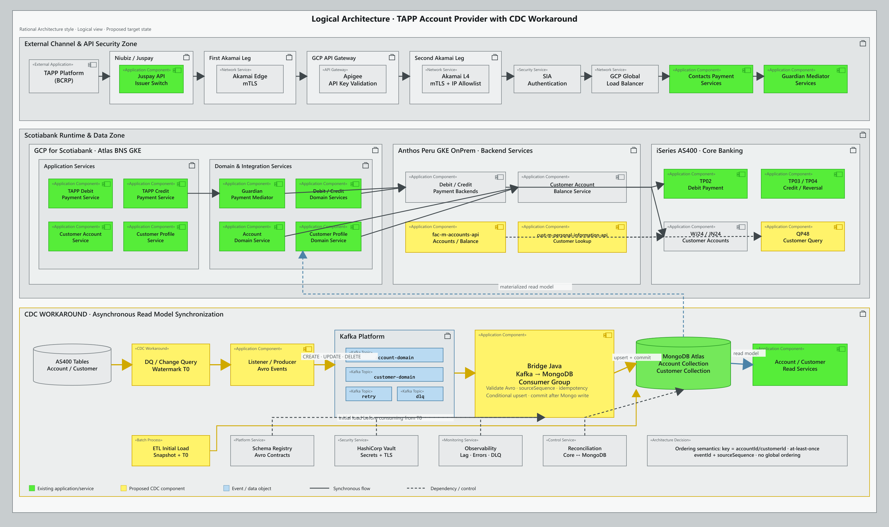
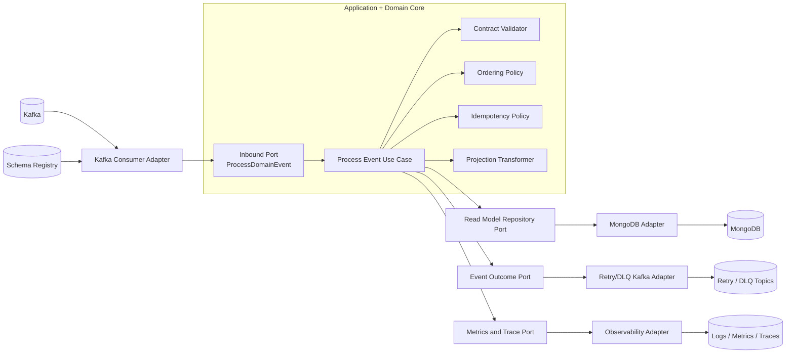

# Diseño consolidado — Niubiz/Juspay, CDC Workaround y Bridge Kafka–MongoDB

**Proyecto:** TAPP / Contacts Payment Services  
**Estado:** propuesta técnica consolidada  
**Fecha:** 26 de agosto de 2026  
**Alcance:** contratos de integración, APIs, CDC Workaround, ordenamiento de eventos, read models de MongoDB y microservicio bridge con arquitectura hexagonal.

> Este documento consolida el análisis realizado sobre los diagramas de arquitectura, el PDF `Juspay-Peru CBS API Specs.pdf`, el archivo `Mapeo Niubiz_V1.xlsx` y los artefactos técnicos preparados en este repositorio. Los nombres o detalles que no aparecen formalmente en las fuentes se identifican como propuestas o puntos pendientes de validación.

> **Sizing actualizado:** la proyección CCE 2027–2032 y la validación empírica de tamaños request/response están documentadas en [`mongodb-sizing-actualizado-2027-2032.md`](./mongodb-sizing-actualizado-2027-2032.md). Esta actualización demuestra que 3 KB no es un máximo general para XML.

## Índice

1. [Resumen ejecutivo](#1-resumen-ejecutivo)
2. [Vista integral de la solución](#2-vista-integral-de-la-solución)
3. [Inventario de contratos y APIs](#3-inventario-de-contratos-y-apis)
4. [Diseño del CDC Workaround](#4-diseño-del-cdc-workaround)
5. [Orden de eventos e idempotencia](#5-orden-de-eventos-e-idempotencia)
6. [Bridge genérico Kafka–MongoDB](#6-bridge-genérico-kafkamongodb)
7. [Arquitectura hexagonal](#7-arquitectura-hexagonal-del-microservicio)
8. [Contrato JSON comentado](#8-contrato-json-genérico-comentado)
9. [Documento MongoDB](#9-documento-mongodb-propuesto)
10. [Flujo del consumidor](#10-flujo-de-procesamiento-del-consumidor)
11. [Reintentos, DLQ y replay](#11-reintentos-dlq-y-replay)
12. [Seguridad](#12-seguridad)
13. [Observabilidad](#13-observabilidad)
14. [Reconciliación](#14-reconciliación)
15. [Disponibilidad](#15-disponibilidad-y-comportamiento-degradado)
16. [Pruebas y aceptación](#16-pruebas-y-criterios-de-aceptación)
17. [Estimación](#17-estimación-preliminar)
18. [Decisiones pendientes](#18-decisiones-pendientes)
19. [Plan de implementación](#19-plan-de-implementación-sugerido)
20. [Artefactos](#20-artefactos-del-repositorio)
21. [Conclusión](#21-conclusión)

## 1. Resumen ejecutivo

La solución tiene dos flujos complementarios:

1. **Flujo transaccional síncrono:** TAPP se integra con Niubiz/Juspay y atraviesa Akamai, Apigee y los controles de seguridad de Scotiabank hasta llegar a los servicios desplegados en GKE. Estos servicios consumen capacidades de Guardian, backend services y Core Banking.
2. **Flujo asíncrono CDC:** los cambios de cuentas y clientes originados en Core se publican en Kafka y un componente bridge los proyecta en colecciones MongoDB. MongoDB funciona como read model para consultas rápidas de Account y Customer.

La propuesta es construir **un bridge genérico y transversal Kafka–MongoDB**, reutilizable mediante configuración. Se recomienda una única base de código e imagen de contenedor, con despliegues independientes por dominio cuando se necesiten aislamiento, escalamiento o ciclos de liberación diferentes.

La garantía alcanzable es:

- orden por agregado dentro de una partición Kafka;
- entrega efectiva `at-least-once`;
- escritura idempotente y condicionada en MongoDB;
- detección de duplicados y eventos atrasados;
- reintentos controlados y DLQ;
- trazabilidad de extremo a extremo.

Kafka **no garantiza orden global entre particiones**. Por eso, la clave del mensaje debe ser estable —por ejemplo `accountId` o `customerId`— y todos los cambios del mismo agregado deben llegar a la misma partición.

## 2. Vista integral de la solución



También está disponible la versión vectorial editable: [cdc-workaround-rational-architecture.svg](./cdc-workaround-rational-architecture.svg).

### 2.1 Flujo síncrono principal

```text
TAPP User
   │
   ▼
Third-Party Application Provider / TAPP Platform
   │
   ▼
Niubiz & Juspay — API Issuer Switch
   │ mTLS + API key
   ▼
Akamai Edge
   │
   ▼
Apigee — External API Gateway
   │
   ▼
Segundo Akamai / L4 routing
   │
   ▼
GCP Global Load Balancer
   │
   ▼
Contacts Payment Services + Domain Services en GKE
   │
   ├── Guardian Mediator Services
   ├── Anthos Backend Services
   └── Core Banking / AS400
```

Controles identificados en los diagramas:

- mTLS entre los principales saltos de red;
- allowlist de IP;
- API key validada en Apigee;
- autenticación SIA externa/interna;
- Akamai en ambos extremos de la ruta;
- balanceador global hacia GKE;
- secretos y certificados administrados fuera del código;
- observabilidad, auditoría y trazabilidad de las llamadas.

### 2.2 Flujo CDC Workaround

```text
Core / AS400
   │ cambios en tablas
   ▼
DQ / Change Query
   │
   ▼
Listener / Producer
   │ evento Avro + clave de agregado
   ▼
Kafka — Account/Customer Domain Topics
   │
   ▼
Bridge Kafka–MongoDB
   │ validación + orden + idempotencia + transformación
   ▼
MongoDB Atlas
   ├── accounts
   └── customers
```

El bridge comienza en Kafka. No reemplaza el mecanismo que detecta los cambios en Core ni al productor que los publica.

## 3. Inventario de contratos y APIs

### 3.1 Contrato externo canónico Niubiz/Juspay CBS

El PDF de Juspay define seis operaciones canónicas. Deben considerarse el contrato externo principal hasta recibir una versión formal más reciente.

| N.º | Operación | Método y ruta | Propósito |
|---:|---|---|---|
| 1 | List Accounts | `POST /v1/cbs/accounts/list` | Listar cuentas asociadas al cliente. |
| 2 | Validate Card Details | `POST /v1/cbs/cards/validate` | Validar los datos de una tarjeta. |
| 3 | Balance Enquiry | `POST /v1/cbs/accounts/balance` | Consultar el saldo de una cuenta. |
| 4 | Credit Money | `POST /v1/cbs/transactions/credit` | Abonar fondos; también representa refund y reversa de débito según `type`. |
| 5 | Debit Money | `POST /v1/cbs/transactions/debit` | Debitar fondos de una cuenta. |
| 6 | Status Check | `POST /v1/cbs/transactions/status` | Consultar el estado de una transacción. |

Reglas relevantes:

- una reversa de débito se modela como Credit Money con `type = DEBIT_REVERSAL`;
- un reembolso se modela como Credit Money con `type = REFUND`;
- no debe crearse un endpoint adicional de reversa si el contrato canónico mantiene esta semántica;
- todavía se deben confirmar catálogos, longitudes, códigos, formatos y localizaciones específicas de Perú.

Contrato OpenAPI: [juspay-peru-cbs-api.yaml](../openapi/juspay-peru-cbs-api.yaml).

### 3.2 Contratos internos inferidos de los diagramas

Además del contrato externo existen borradores internos que organizan las responsabilidades de dominio. Son propuestas técnicas y deben validarse con los equipos propietarios.

| Servicio interno | Operaciones consideradas |
|---|---|
| Customer Profile Service | obtener perfil del cliente |
| Account Service | listar cuentas y obtener detalle de cuenta |
| Debit Card Service | validar tarjeta de débito |
| Debit Payment Service | crear débito y revertir débito |
| Credit Payment Service | crear crédito |

Inventario operativo usado para la estimación:

1. `listCustomerAccounts`
2. `getAccountDetail`
3. `getAccountBalance`
4. `getCustomerProfile`
5. `validateDebitCard`
6. `createCreditTransaction`
7. `createDebitTransaction`
8. `reverseDebitTransaction`

Esto representa **8 operaciones internas distribuidas en 5 contratos OpenAPI**, no necesariamente 8 microservicios independientes.

Archivos:

- [accounts-api.yaml](../openapi/accounts-api.yaml)
- [customer-profile-api.yaml](../openapi/customer-profile-api.yaml)
- [debit-card-api.yaml](../openapi/debit-card-api.yaml)
- [debit-payments-api.yaml](../openapi/debit-payments-api.yaml)
- [credit-payments-api.yaml](../openapi/credit-payments-api.yaml)

### 3.3 Contratos asíncronos

Los eventos Kafka internos se documentan en:

- [asyncapi-cdc.yaml](../asyncapi-cdc.yaml)
- [asyncapi.yaml](../asyncapi.yaml)
- [account-domain-event.avsc](../avro/account-domain-event.avsc)
- [customer-domain-event.avsc](../avro/customer-domain-event.avsc)

Los esquemas Avro son los contratos ejecutables recomendados. El JSON comentado de este documento es una explicación legible y una propuesta de sobre común; ambos deben alinearse antes del desarrollo.

### 3.4 Diccionario de datos consolidado

El Excel organizado contiene una hoja por endpoint y anexos técnicos:

- **14 hojas de endpoints:** 6 operaciones CBS canónicas y 8 operaciones internas;
- **946 campos HTTP documentados**;
- **356 filas de mapeo Niubiz**;
- **9 consultas pendientes a Niubiz**;
- catálogos, AsyncAPI, eventos, Avro, pendientes de Perú y fuentes.

Archivo: [diccionario_datos_contratos_niubiz_juspay_ordenado.xlsx](../../outputs/niubiz-juspay-contracts/diccionario_datos_contratos_niubiz_juspay_ordenado.xlsx).

## 4. Diseño del CDC Workaround

### 4.1 Objetivo

Mantener read models de Account y Customer en MongoDB para desacoplar las consultas de lectura del Core Banking y reducir latencia y carga sobre sistemas legacy.

### 4.2 Carga inicial

Antes de consumir cambios incrementales se necesita una fotografía coherente del estado inicial:

```text
Core ──► ETL / Full Refresh ──► MongoDB
              │
              └── registra watermark T0
```

Procedimiento recomendado:

1. definir el conjunto exacto de tablas y columnas fuente;
2. registrar un watermark de corte `T0` o una posición equivalente del log;
3. extraer la fotografía inicial;
4. transformar y cargar las colecciones MongoDB;
5. validar conteos, muestras y totales de control;
6. activar el consumidor incremental desde `T0`;
7. permitir que el consumidor alcance el presente;
8. habilitar el read model para tráfico de consulta.

La carga inicial y los eventos incrementales no deben dejar una ventana sin cubrir ni aplicar cambios dos veces sin protección idempotente.

### 4.3 Captura continua

Los diagramas proponen un workaround basado en DQ y un Listener/Producer:

1. DQ detecta o consulta los cambios de las tablas de Core;
2. el Listener/Producer construye eventos de dominio;
3. serializa en Avro y publica en Kafka;
4. Kafka conserva los mensajes durante el período configurado;
5. el bridge consume y materializa el estado en MongoDB;
6. las APIs de Account y Customer leen las colecciones materializadas.

## 5. Orden de eventos e idempotencia

### 5.1 Qué garantiza Kafka

Kafka mantiene el orden únicamente dentro de una partición. Para conservar la secuencia de un agregado:

- todos los eventos de una cuenta deben usar `accountId` como clave Kafka;
- todos los eventos de un cliente deben usar `customerId` como clave Kafka;
- el productor debe usar el mismo algoritmo de particionado;
- no se debe cambiar la cantidad de particiones sin evaluar la redistribución de claves;
- el consumidor debe procesar secuencialmente cada partición o aplicar un mecanismo que preserve ese orden.

No se requiere ni se debe prometer orden global entre cuentas o clientes distintos.

### 5.2 Doble control de secuencia

La clave Kafka mantiene la afinidad de partición, pero se recomienda incluir también una secuencia monotónica por agregado:

- `aggregateVersion`, si el sistema fuente puede versionar el agregado;
- `sourceSequence`, si el capturador entrega una secuencia monotónica;
- `sourcePosition`, si se dispone de posición de log, LSN o equivalente.

Regla de aplicación:

```text
aplicar evento si incomingSequence > storedSequence
ignorar como duplicado si eventId ya fue procesado
ignorar como atrasado si incomingSequence <= storedSequence
```

### 5.3 Semántica de entrega

La solución recomendada es `at-least-once` con consumidor idempotente. Es más realista que prometer exactamente una vez entre Kafka y MongoDB, porque el commit del offset Kafka y la escritura MongoDB no forman una única transacción distribuida.

Para lograr consistencia observable:

1. escribir en MongoDB mediante `upsert` condicional;
2. guardar metadatos del último evento aplicado;
3. confirmar el offset únicamente después de una salida durable;
4. si el proceso cae después de escribir y antes de confirmar, el evento se repite pero no modifica nuevamente el estado;
5. si el evento es antiguo o duplicado, se clasifica y luego se confirma su offset.

## 6. Bridge genérico Kafka–MongoDB

### 6.1 Alcance recomendado

El bridge debe ser genérico en la infraestructura y explícito en la configuración de cada dominio. No conviene implementar un consumidor sin esquema que copie cualquier JSON directamente a cualquier colección.

Responsabilidades:

- consumir uno o más tópicos autorizados;
- deserializar usando Schema Registry;
- validar el sobre y el payload;
- enrutar según tópico, dominio y versión de esquema;
- verificar duplicidad y orden;
- transformar el evento al modelo MongoDB;
- ejecutar `upsert`, actualización parcial o baja lógica;
- publicar reintentos y DLQ;
- confirmar offsets;
- emitir métricas, logs estructurados y trazas.

Fuera de alcance:

- consultar directamente las tablas del Core;
- detectar cambios en AS400;
- reemplazar DQ, IBM Data Replication o el productor CDC;
- servir endpoints de negocio;
- resolver inconsistencias históricas sin un proceso de reconciliación.

### 6.2 Estrategia de reutilización

Se recomienda:

- una base de código;
- una imagen de contenedor versionada;
- configuración externa por dominio;
- un despliegue para Account y otro para Customer;
- `consumer-group` independiente por proyección;
- escalamiento limitado por la cantidad de particiones;
- permisos de MongoDB y Kafka con mínimo privilegio.

| Despliegue | Tópico de entrada | Clave Kafka | Colección destino |
|---|---|---|---|
| `account-read-model-bridge` | `account-domain` | `accountId` | `accounts` |
| `customer-read-model-bridge` | `customer-domain` | `customerId` | `customers` |

### 6.3 Configuración de ejemplo

```yaml
bridge:
  routes:
    - name: account-read-model
      topic: account-domain
      consumerGroup: cdc-account-mongo-v1
      aggregateType: ACCOUNT
      keyField: accountId
      collection: accounts
      schemaSubject: account-domain-event-value
      transformer: account-v1
      writeMode: CONDITIONAL_UPSERT
      sequenceField: sourceSequence
      retryTopic: account-domain.retry
      deadLetterTopic: account-domain.dlq

    - name: customer-read-model
      topic: customer-domain
      consumerGroup: cdc-customer-mongo-v1
      aggregateType: CUSTOMER
      keyField: customerId
      collection: customers
      schemaSubject: customer-domain-event-value
      transformer: customer-v1
      writeMode: CONDITIONAL_UPSERT
      sequenceField: sourceSequence
      retryTopic: customer-domain.retry
      deadLetterTopic: customer-domain.dlq
```

## 7. Arquitectura hexagonal del microservicio



### 7.1 Núcleo de dominio

Objetos recomendados:

- `DomainEvent`: sobre normalizado del evento;
- `AggregateId`: identidad tipada del agregado;
- `EventId`: identidad única del evento;
- `SourceSequence`: secuencia comparable;
- `ProjectionDocument`: documento a materializar;
- `ProcessingOutcome`: resultado `APPLIED`, `DUPLICATE`, `STALE`, `DELETED`, `RETRY` o `DLQ`;
- `OrderingPolicy`: decide si el evento puede aplicarse;
- `IdempotencyPolicy`: detecta reentrega;
- `ProjectionPolicy`: define upsert, patch o delete lógico.

El dominio no debe depender de clases de Kafka, MongoDB, Spring o Avro.

### 7.2 Puertos de entrada

- `ProcessDomainEventUseCase`
- `ReplayDeadLetterEventUseCase`
- `HealthCheckUseCase`
- `ReconciliationUseCase`, si la reconciliación se incluye en el mismo componente

### 7.3 Puertos de salida

- `ReadModelRepositoryPort`
- `SchemaDecoderPort`
- `RetryPublisherPort`
- `DeadLetterPublisherPort`
- `ProcessedEventStorePort`, si la deduplicación se separa del documento
- `ClockPort`
- `MetricsPort`
- `TracingPort`

### 7.4 Adaptadores

Entrada:

- Kafka consumer;
- endpoint administrativo para health/readiness;
- comando operativo de replay, protegido y auditado.

Salida:

- MongoDB repository;
- Schema Registry client;
- Kafka retry/DLQ producer;
- Vault/Secret Manager client;
- OpenTelemetry, métricas y logs estructurados.

### 7.5 Estructura de paquetes sugerida

```text
src/main/java/com/scotiabank/tapp/cdcbridge/
├── domain/
│   ├── model/
│   ├── policy/
│   └── exception/
├── application/
│   ├── port/in/
│   ├── port/out/
│   └── service/
├── adapter/
│   ├── in/kafka/
│   ├── in/admin/
│   ├── out/mongodb/
│   ├── out/kafka/
│   ├── out/schema/
│   └── out/observability/
└── configuration/
```

## 8. Contrato JSON genérico comentado

> JSON estándar no admite comentarios. El siguiente ejemplo usa **JSONC únicamente para documentación**. Los mensajes reales deben enviarse como Avro o JSON válido sin comentarios. En Avro, la descripción de cada atributo se coloca en la propiedad `doc`.

```jsonc
{
  "specVersion": "1.0", // Versión del sobre común, independiente del payload.
  "eventId": "018f4d9d-2cc8-7c22-a530-85db6fae7212", // Identificador global e inmutable del evento; se usa para deduplicar.
  "eventType": "ACCOUNT_UPDATED", // Tipo funcional del evento: ACCOUNT_CREATED, ACCOUNT_UPDATED o ACCOUNT_DELETED.
  "aggregateType": "ACCOUNT", // Dominio o agregado afectado; por ejemplo ACCOUNT o CUSTOMER.
  "aggregateId": "ACC-000123456", // Identificador estable del agregado; debe coincidir con la clave del mensaje Kafka.
  "operation": "UPSERT", // Acción sobre la proyección: UPSERT, PATCH o DELETE.
  "aggregateVersion": 27, // Versión monotónica del agregado, si el sistema fuente puede producirla.
  "sourceSequence": 98457321, // Secuencia monotónica usada para rechazar eventos atrasados.
  "sourcePosition": "AS400:JRN001:00098457321", // Posición del journal/log fuente para auditoría y recuperación.
  "schemaVersion": 1, // Versión del esquema del payload; selecciona el transformer compatible.
  "payloadMode": "FULL_SNAPSHOT", // FULL_SNAPSHOT reemplaza el estado funcional; PATCH modifica solo campos informados.
  "occurredAt": "2026-08-26T14:35:42.128-05:00", // Fecha y hora en que ocurrió el cambio en el sistema fuente.
  "publishedAt": "2026-08-26T14:35:42.740-05:00", // Fecha y hora en que el productor publicó el evento.

  "source": { // Identifica de dónde se originó el cambio.
    "system": "AS400", // Sistema fuente responsable del dato.
    "database": "CORE_BANKING", // Base o contexto lógico de origen.
    "table": "ACCOUNT_MASTER", // Tabla principal que originó el evento.
    "region": "PE", // País o región funcional del dato.
    "producer": "core-account-cdc-producer" // Aplicación que construyó y publicó el evento.
  },

  "trace": { // Información de correlación; no debe contener secretos ni datos sensibles.
    "correlationId": "corr-3ca73929-a6b0-4da0", // Une el evento con la operación o lote de origen.
    "traceId": "4bf92f3577b34da6a3ce929d0e0e4736", // Identificador de traza distribuida OpenTelemetry/W3C.
    "causationId": "cmd-812734" // Identificador del evento o comando que causó este cambio.
  },

  "payload": { // Estado funcional a proyectar en la colección MongoDB.
    "accountId": "ACC-000123456", // Identificador único de la cuenta; corresponde al aggregateId.
    "customerId": "CUS-000778899", // Identificador del titular o cliente relacionado.
    "accountNumberMasked": "************3456", // Número enmascarado; nunca registrar el número completo en logs.
    "accountType": "SAVINGS", // Tipo normalizado de cuenta, sujeto al catálogo aprobado.
    "currency": "PEN", // Moneda ISO 4217 de la cuenta.
    "status": "ACTIVE", // Estado funcional normalizado de la cuenta.
    "availableBalance": 1250.75, // Saldo disponible; debe representarse con Decimal128 en MongoDB.
    "ledgerBalance": 1300.75, // Saldo contable; debe representarse con Decimal128 en MongoDB.
    "branchCode": "0191", // Código de oficina o sucursal de origen.
    "productCode": "AHO-PEN-01", // Código del producto bancario.
    "openedAt": "2021-06-14", // Fecha de apertura en formato ISO 8601 YYYY-MM-DD.
    "updatedAt": "2026-08-26T14:35:42.128-05:00" // Última actualización funcional reportada por Core.
  }
}
```

### 8.1 Reglas mínimas del contrato

- `eventId`, `eventType`, `aggregateType`, `aggregateId`, `operation`, `schemaVersion`, `occurredAt`, `source` y `payload` son obligatorios para eventos de upsert;
- la clave Kafka debe ser exactamente el `aggregateId` normalizado;
- se debe definir una estrategia obligatoria de secuencia: `aggregateVersion`, `sourceSequence` o una posición de journal comparable;
- valores monetarios no deben serializarse como `double` si pueden perder precisión;
- timestamps deben incluir zona horaria o expresarse en UTC;
- datos sensibles deben clasificarse y enmascararse;
- cambios incompatibles requieren una nueva versión mayor del esquema;
- el consumidor debe rechazar esquemas desconocidos y dirigirlos a DLQ con contexto técnico seguro.

## 9. Documento MongoDB propuesto

```jsonc
{
  "_id": "ACC-000123456", // Clave primaria de MongoDB y aggregateId.
  "customerId": "CUS-000778899", // Cliente asociado a la cuenta.
  "accountNumberMasked": "************3456", // Número enmascarado para lectura segura.
  "accountType": "SAVINGS", // Tipo normalizado de cuenta.
  "currency": "PEN", // Moneda ISO 4217.
  "status": "ACTIVE", // Estado actual proyectado.
  "availableBalance": { "$numberDecimal": "1250.75" }, // Saldo disponible como Decimal128.
  "ledgerBalance": { "$numberDecimal": "1300.75" }, // Saldo contable como Decimal128.
  "branchCode": "0191", // Oficina del producto.
  "productCode": "AHO-PEN-01", // Producto bancario.
  "openedAt": "2021-06-14", // Fecha de apertura.
  "updatedAt": "2026-08-26T14:35:42.128-05:00", // Fecha funcional del último cambio.
  "deleted": false, // Marca de baja lógica para eventos DELETE.

  "_cdc": { // Metadatos técnicos de la proyección; no forman parte del contrato funcional de consulta.
    "lastEventId": "018f4d9d-2cc8-7c22-a530-85db6fae7212", // Último evento aplicado.
    "lastAggregateVersion": 27, // Última versión de agregado aceptada.
    "lastSourceSequence": 98457321, // Última secuencia fuente aceptada.
    "lastSourcePosition": "AS400:JRN001:00098457321", // Última posición fuente aplicada.
    "schemaVersion": 1, // Versión del evento que produjo el documento.
    "topic": "account-domain", // Tópico Kafka de procedencia.
    "partition": 3, // Partición Kafka del último evento.
    "offset": 847221, // Offset Kafka del último evento.
    "processedAt": "2026-08-26T14:35:43.015-05:00" // Momento de aplicación en MongoDB.
  }
}
```

### 9.1 Escritura condicional

Conceptualmente, el filtro de actualización debe aceptar únicamente un evento más nuevo:

```javascript
{
  _id: incoming.aggregateId,
  $or: [
    { "_cdc.lastSourceSequence": { $exists: false } },
    { "_cdc.lastSourceSequence": { $lt: incoming.sourceSequence } }
  ]
}
```

La transformación genera un `$set` con el payload y los metadatos `_cdc`. Para una carga completa, se debe retirar o marcar cualquier campo que haya dejado de existir de acuerdo con el contrato. Para un patch, solo se actualizan los atributos declarados.

Índices mínimos sugeridos:

- `_id` único por `accountId` o `customerId`;
- índice por `customerId` para listar cuentas de un cliente;
- índices por campos reales de consulta, verificados mediante `explain`;
- ningún índice adicional sin una consulta o requisito operativo que lo justifique.

## 10. Flujo de procesamiento del consumidor

```text
1. Kafka entrega el mensaje
2. Validar headers, clave y tamaño
3. Deserializar con Schema Registry
4. Validar contrato y versión
5. Normalizar al DomainEvent
6. Verificar eventId y sourceSequence
7. Transformar a ProjectionDocument
8. Ejecutar escritura condicional en MongoDB
9. Clasificar resultado
10. Emitir métricas/traza
11. Confirmar offset después de una salida durable
```

Resultados:

| Resultado | Significado | Acción sobre el offset |
|---|---|---|
| `APPLIED` | El documento fue creado o actualizado. | Confirmar. |
| `DUPLICATE` | El `eventId` ya se procesó. | Confirmar. |
| `STALE` | La secuencia es menor o igual que la almacenada. | Confirmar y medir. |
| `DELETED` | Se aplicó una baja lógica o física autorizada. | Confirmar. |
| `RETRY` | Error transitorio de MongoDB, red o dependencia. | Publicar en retry y confirmar el origen solo tras el ack del retry. |
| `DLQ` | Esquema inválido, dato irreparable o reintentos agotados. | Publicar en DLQ y confirmar el origen solo tras el ack de la DLQ. |

## 11. Reintentos, DLQ y replay

Se recomienda usar tópicos de retry con espera creciente y una DLQ por dominio:

```text
account-domain
   ├── account-domain.retry.1
   ├── account-domain.retry.2
   ├── account-domain.retry.3
   └── account-domain.dlq
```

La DLQ debe conservar:

- tópico, partición y offset originales;
- clave Kafka original;
- `eventId`, tipo y versión de esquema;
- categoría de error y número de intentos;
- timestamps de recepción y fallo;
- payload original o referencia segura, sujeto a clasificación de datos;
- identificador de traza.

El replay debe ser explícito, autorizado, auditable e idempotente. Nunca debe omitir la validación de secuencia.

## 12. Seguridad

- TLS/mTLS para Kafka, MongoDB, Schema Registry y endpoints administrativos;
- credenciales obtenidas desde Vault o Secret Manager;
- rotación de secretos sin reconstruir la imagen;
- ACL de Kafka por tópico y consumer group;
- rol MongoDB limitado a las colecciones necesarias;
- Network Policies y conectividad privada;
- imágenes firmadas y escaneadas;
- sin credenciales en configuración, repositorio, logs o DLQ;
- enmascaramiento de números de cuenta, tarjeta y cualquier PII;
- auditoría de replay y operaciones manuales.

## 13. Observabilidad

Métricas mínimas:

- lag por tópico y partición;
- eventos consumidos, aplicados, duplicados y atrasados;
- errores por tipo y versión de esquema;
- reintentos y mensajes en DLQ;
- latencia `occurredAt → processedAt`;
- duración y errores de escritura MongoDB;
- rebalances del consumer group;
- discrepancias detectadas por reconciliación.

Logs estructurados mínimos:

- `eventId`;
- `aggregateId` enmascarado o tokenizado si corresponde;
- `eventType`;
- `topic`, `partition`, `offset`;
- `sourceSequence`;
- `outcome`;
- `correlationId` y `traceId`;
- código técnico de error, sin exponer el payload sensible.

Alertas sugeridas:

- lag por encima del SLO durante una ventana sostenida;
- crecimiento de DLQ;
- ausencia de eventos cuando se esperan cambios;
- porcentaje anormal de eventos `STALE` o `DUPLICATE`;
- errores de autenticación o conexión;
- discrepancia de reconciliación por encima del umbral.

## 14. Reconciliación

El CDC no sustituye la verificación periódica de consistencia. Se necesita un proceso que compare Core y MongoDB mediante:

- conteos por segmento, fecha, producto o estado;
- checksums o hashes de atributos relevantes;
- muestreo de registros;
- detección de documentos faltantes, extras o divergentes;
- reparación controlada mediante evento correctivo o recarga segmentada.

La reconciliación debe tener un responsable operativo, un calendario y un runbook de corrección.

## 15. Disponibilidad y comportamiento degradado

Cuando MongoDB no esté disponible:

- el consumidor debe reintentar con backoff y circuit breaker;
- Kafka conserva el backlog según su retención;
- el lag aumenta y debe generar alerta;
- las APIs de lectura deben aplicar una política acordada: error temporal, dato con indicador de antigüedad o fallback autorizado hacia Core;
- al restablecer MongoDB, el consumidor reprocesa desde el último offset confirmado.

No se debe ocultar un read model desactualizado sin informar su antigüedad o superar el SLO acordado.

## 16. Pruebas y criterios de aceptación

### 16.1 Pruebas funcionales

- crear, actualizar y eliminar lógicamente una cuenta;
- crear y actualizar un cliente;
- evento duplicado con el mismo `eventId`;
- evento atrasado con secuencia menor;
- dos eventos consecutivos del mismo agregado;
- eventos paralelos de agregados diferentes;
- contrato o versión desconocida;
- payload inválido;
- cambio compatible de esquema.

### 16.2 Pruebas de resiliencia

- caída de MongoDB antes de la escritura;
- caída del proceso después de escribir y antes del commit;
- reinicio del pod;
- rebalance del consumer group;
- indisponibilidad de Schema Registry;
- error al publicar retry o DLQ;
- backlog mayor que la capacidad normal;
- replay de DLQ.

### 16.3 Pruebas de datos y rendimiento

- conciliación de la carga inicial;
- carga simultánea inicial más CDC incremental;
- throughput máximo esperado y picos;
- latencia p95/p99 de proyección;
- verificación de índices MongoDB;
- crecimiento de almacenamiento y retención Kafka;
- backpressure sin pérdida de mensajes.

### 16.4 Criterios mínimos de aceptación

- un agregado mantiene el orden lógico con clave estable;
- una reentrega no duplica el efecto;
- un evento atrasado no sobrescribe el estado nuevo;
- la escritura se recupera tras una caída sin intervención manual ordinaria;
- todo evento termina aplicado, clasificado como duplicado/atrasado, en retry o en DLQ;
- offsets solo se confirman después de una salida durable;
- dashboards y alertas permiten localizar tópico, partición, offset y error;
- la reconciliación detecta diferencias de Core frente a MongoDB;
- contratos y compatibilidad de esquema se validan en CI/CD.

## 17. Estimación preliminar

La estimación depende de accesos, definición del contrato fuente, infraestructura disponible, ambientes, pruebas con Core y aprobaciones de seguridad.

### 17.1 Bridge Kafka–MongoDB

| Fase | Alcance | Tiempo estimado |
|---|---|---:|
| Descubrimiento y contratos | tablas fuente, secuencia, Avro, claves, Mongo y SLO | 1 semana |
| Base hexagonal | consumidor, dominio, adaptadores, configuración y health checks | 1 semana |
| Consistencia | upsert condicional, idempotencia, orden, retry, DLQ y replay | 1–2 semanas |
| Operación | seguridad, métricas, trazas, dashboards y despliegue GKE | 1–2 semanas |
| Validación | pruebas integrales, rendimiento, resiliencia y reconciliación | 1–2 semanas |

**MVP técnico:** 3–4 semanas.  
**Versión productiva:** 5–8 semanas con un equipo de 2 desarrolladores backend, 1 QA con dedicación parcial y soporte de plataforma/datos/seguridad.  
**Account + Customer:** la reutilización del bridge reduce el segundo dominio, pero cada transformer, contrato y set de pruebas continúa siendo específico.

### 17.2 APIs y contratos

Para las 6 operaciones CBS externas y las 8 operaciones internas:

| Trabajo | Estimación orientativa |
|---|---:|
| Confirmación de contratos, catálogos y mapeos Perú | 1–2 semanas |
| Implementación de operaciones, validaciones y adaptadores | 4–7 semanas |
| Seguridad, auditoría, observabilidad y manejo de errores | 1–2 semanas en paralelo |
| Pruebas unitarias, contrato, integración y certificación | 2–4 semanas |

**Rango integral preliminar:** 8–12 semanas con trabajo paralelo y dependencias disponibles. Puede ampliarse si Niubiz, Core, SIA, certificados, redes o ambientes no están listos.

Esta cifra corresponde al conjunto de operaciones, no a crear catorce microservicios. La distribución final debe seguir límites de dominio, carga y ownership.

## 18. Decisiones pendientes

Antes de cerrar el diseño se debe confirmar:

1. tablas y campos autoritativos de Account y Customer;
2. mecanismo real de captura: DQ/Listener, IBM Data Replication u otro;
3. watermark de la carga inicial y punto exacto de inicio del CDC;
4. clave Kafka definitiva para cada dominio;
5. origen y semántica de `sourceSequence` o `aggregateVersion`;
6. cantidad inicial de particiones y política de crecimiento;
7. nombres definitivos de tópicos, consumer groups y colecciones;
8. estrategia `FULL_SNAPSHOT` frente a `PATCH`;
9. baja física frente a baja lógica;
10. compatibilidad configurada en Schema Registry;
11. retención de Kafka, retry y DLQ;
12. RPO, RTO, SLO de lag y latencia de proyección;
13. política de lectura cuando MongoDB esté desactualizado;
14. responsable del replay y de la reconciliación;
15. catálogos y localizaciones definitivas para Perú;
16. SLAs, timeouts, códigos y formatos finales de Niubiz/Juspay.

## 19. Plan de implementación sugerido

### Etapa 1 — Diseño ejecutable

- cerrar contrato Avro y sobre común;
- validar claves, secuencias y estrategia de particionado;
- aprobar modelos e índices MongoDB;
- definir SLOs y política de errores;
- ejecutar pruebas de contrato en CI.

### Etapa 2 — PoC Account

- procesar `ACCOUNT_CREATED`, `ACCOUNT_UPDATED` y `ACCOUNT_DELETED`;
- demostrar orden, idempotencia, retry y DLQ;
- medir throughput, lag y latencia;
- ejecutar una carga inicial pequeña y reconciliarla.

### Etapa 3 — Productivización

- integrar Vault, TLS/mTLS y ACLs;
- desplegar en GKE con probes, autoscaling y límites;
- crear dashboards, alertas y runbooks;
- validar recuperación ante fallos y replay;
- certificar rendimiento y seguridad.

### Etapa 4 — Customer y expansión

- agregar transformer y despliegue Customer;
- reutilizar el núcleo y adaptadores comunes;
- validar esquema, consultas e índices propios;
- incorporar nuevos dominios solo mediante contrato, configuración y pruebas explícitas.

## 20. Artefactos del repositorio

| Artefacto | Uso |
|---|---|
| [Arquitectura Rational PNG](./cdc-workaround-rational-architecture.png) | Vista profesional de la solución completa. |
| [Arquitectura Rational SVG](./cdc-workaround-rational-architecture.svg) | Versión vectorial editable. |
| [Propuesta detallada del read model](../propuesta-arquitectura-cdc-read-model-cuentas.md) | Diseño extendido específico de Account. |
| [Diagrama Draw.io](../arquitectura-cdc-read-model-cuentas.drawio) | Fuente editable del diagrama técnico anterior. |
| [OpenAPI CBS](../openapi/juspay-peru-cbs-api.yaml) | Contrato externo Niubiz/Juspay. |
| [README de contratos](../openapi/README.md) | Clasificación y advertencias de los OpenAPI. |
| [AsyncAPI CDC](../asyncapi-cdc.yaml) | Contrato de mensajería CDC. |
| [Avro Account](../avro/account-domain-event.avsc) | Esquema de eventos de cuenta. |
| [Avro Customer](../avro/customer-domain-event.avsc) | Esquema de eventos de cliente. |
| [MongoDB Sizing Questionnaire](./mongodb-sizing-questionnaire-tapp.md) | Dimensionamiento preliminar de datos, carga, índices y SLA. |
| [Presupuesto MongoDB TAPP](./presupuesto-mongodb-tapp.md) | Costos regulares, TCO, escenarios y controles FinOps. |
| [Excel de diccionario de datos](../../outputs/niubiz-juspay-contracts/diccionario_datos_contratos_niubiz_juspay_ordenado.xlsx) | Diccionario ordenado, una hoja por endpoint. |

## 21. Conclusión

Sí es viable construir un componente genérico y transversal que consuma Kafka y materialice información en MongoDB para el CDC Workaround. La generalización debe concentrarse en las capacidades técnicas —consumo, validación, orden, idempotencia, escritura, retry, DLQ y observabilidad— mientras cada dominio mantiene un contrato, un transformer y una configuración explícitos.

El punto más importante no es solamente mover JSON de Kafka a MongoDB. La solución debe preservar la secuencia por agregado, tolerar reentregas, impedir que eventos antiguos sobrescriban estados recientes, controlar la evolución del esquema y permitir reconciliar el read model con Core. Con esas condiciones, el bridge puede reutilizarse de forma segura para Account, Customer y futuros dominios.
