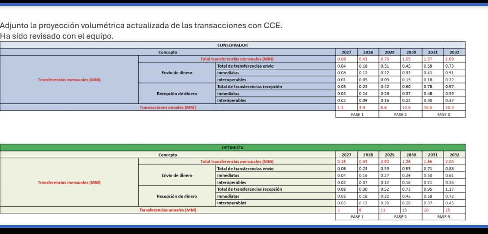

# MongoDB sizing actualizado y prueba de tamaños XML — TAPP/CCE

**Fecha:** 1 de septiembre de 2026  
**Estado:** estimación técnica para validación  
**Horizonte:** 2027–2032  
**Retención usada en el cálculo:** 365 días  
**Flujo:** Kafka → bridge/read model → MongoDB



## 1. Conclusión ejecutiva

La prueba confirma que **3 KB no es un máximo válido para los request/response XML**:

- un `ReqPay` simple y sin firma mide **2.18 KiB**, por lo que 3 KB sí puede ser un valor promedio para mensajes pequeños;
- un `ReqPay` conservador, con campos opcionales poblados, mide **5.34 KiB sin firma** y **7.56 KiB con firma dummy**;
- la muestra máxima entregada mide **9.49 KiB sin firma** y **11.71 KiB con firma dummy**;
- `RespListAccount` supera 3 KiB a partir de **7 cuentas sin firma**;
- con una firma XML de 2.22 KiB, incluso una respuesta de una cuenta supera 3 KiB.

Por tanto, se deben separar dos supuestos:

1. **Documento MongoDB compacto:** 3 KB puede seguir usándose provisionalmente para el read model si MongoDB no guarda XML crudo y se valida con BSON real.
2. **Request/response XML:** usar provisionalmente **12 KiB por mensaje** como envolvente conservadora basada en la evidencia actual; establecer un límite técnico mayor, por ejemplo 32 KiB, sin confundirlo con el promedio usado para almacenamiento.

## 2. Proyección volumétrica recibida

Para evitar diferencias por redondeo, los cálculos usan la fila oficial de transacciones anuales.

### 2.1 Escenario conservador

| Año | Total mensual (MM) | Total anual (MM) | Fase |
|---:|---:|---:|---:|
| 2027 | 0.09 | 1.1 | 1 |
| 2028 | 0.41 | 4.9 | 1 |
| 2029 | 0.73 | 8.8 | 2 |
| 2030 | 1.05 | 12.6 | 2 |
| 2031 | 1.37 | 16.5 | 3 |
| 2032 | 1.69 | 20.3 | 3 |

### 2.2 Escenario optimista

| Año | Total mensual (MM) | Total anual (MM) | Fase |
|---:|---:|---:|---:|
| 2027 | 0.15 | 2.0 | 1 |
| 2028 | 0.53 | 6.0 | 1 |
| 2029 | 0.90 | 11.0 | 2 |
| 2030 | 1.28 | 15.0 | 2 |
| 2031 | 1.66 | 20.0 | 3 |
| 2032 | 2.04 | 25.0 | 3 |

Existen diferencias de redondeo de hasta 0.01 MM entre algunos subtotales y totales de la imagen. Esto equivale a hasta 10 000 transacciones mensuales. No se sumaron los subtotales; se tomaron como fuente de verdad los totales oficiales.

## 3. Prueba reproducible de request y response

### 3.1 Metodología

- Codificación: UTF-8 sin BOM.
- Tamaño principal: bytes sin comprimir; `1 KiB = 1024 bytes`.
- Se generaron perfiles realista, conservador y máximo.
- La muestra máxima de `ReqPay` y el `RespListAccount` de cinco cuentas se extrajeron del texto entregado.
- Los XML generados contienen datos dummy completos y fueron validados como XML bien formado.
- La firma XMLDSig agrega **2 271 bytes / 2.22 KiB**. Sus valores son dummy y **no son criptográficamente válidos**; sirven únicamente para medir tamaño.
- El CSV también incluye tamaño minificado y gzip. No se usa gzip para el sizing porque los datos dummy repetitivos comprimen artificialmente mejor que datos reales, certificados y valores cifrados.

### 3.2 `ReqPay`

| Perfil | Sin firma | Con firma dummy | Resultado frente a 3 KiB |
|---|---:|---:|---|
| Realista | 2 227 B / 2.18 KiB | 4 498 B / 4.39 KiB | Solo el unsigned cabe. |
| Conservador | 5 467 B / 5.34 KiB | 7 738 B / 7.56 KiB | No cabe. |
| Máximo recibido | 9 721 B / 9.49 KiB | 11 992 B / 11.71 KiB | No cabe; casi 4× el supuesto firmado. |

La minificación tampoco corrige la diferencia: el `ReqPay` máximo minificado conserva **8.98 KiB sin firma** y **11.06 KiB con firma**.

### 3.3 `RespListAccount`

| Cuentas | Sin firma | Con firma dummy | Observación |
|---:|---:|---:|---|
| 1 | 901 B / 0.88 KiB | 3 172 B / 3.10 KiB | La firma ya supera 3 KiB. |
| 5, muestra recibida | 2 363 B / 2.31 KiB | 4 634 B / 4.53 KiB | Evidencia original. |
| 5, dummy generado | 2 565 B / 2.50 KiB | 4 836 B / 4.72 KiB | Diferencia por valores dummy y formato. |
| 7 | 3 397 B / 3.32 KiB | 5 668 B / 5.54 KiB | Primer caso unsigned sobre 3 KiB. |
| 10 | 4 645 B / 4.54 KiB | 6 916 B / 6.75 KiB | Crecimiento lineal. |
| 20 | 8 805 B / 8.60 KiB | 11 076 B / 10.82 KiB | Requiere envolvente mayor. |
| 50 | 21 285 B / 20.79 KiB | 23 556 B / 23.00 KiB | 32 KiB todavía lo cubre. |

Con la estructura dummy usada, cada cuenta agrega aproximadamente **416 bytes**. La muestra original agregaba cerca de 375 bytes por cuenta; la diferencia corresponde a nombres, identificadores e indentación.

## 4. Throughput actualizado

Supuestos provisionales:

- promedio distribuido en 365 días;
- factor pico de 10×;
- cuatro eventos/upserts MongoDB por transacción;
- un documento consolidado por transacción, no cuatro documentos independientes.

### 4.1 Escenario conservador

| Año | TPS promedio | TPS pico 10× | Escrituras/s pico, 4 eventos |
|---:|---:|---:|---:|
| 2027 | 0.035 | 0.349 | 1.40 |
| 2028 | 0.155 | 1.554 | 6.22 |
| 2029 | 0.279 | 2.790 | 11.16 |
| 2030 | 0.400 | 3.995 | 15.98 |
| 2031 | 0.523 | 5.232 | 20.93 |
| 2032 | 0.644 | 6.437 | 25.75 |

### 4.2 Escenario optimista

| Año | TPS promedio | TPS pico 10× | Escrituras/s pico, 4 eventos |
|---:|---:|---:|---:|
| 2027 | 0.063 | 0.634 | 2.54 |
| 2028 | 0.190 | 1.903 | 7.61 |
| 2029 | 0.349 | 3.488 | 13.95 |
| 2030 | 0.476 | 4.756 | 19.03 |
| 2031 | 0.634 | 6.342 | 25.37 |
| 2032 | 0.793 | 7.927 | 31.71 |

La prueba anterior de 5 escrituras/s queda corta desde 2028. Para cubrir 2032 optimista:

- prueba objetivo mínima: **40 escrituras/s**, que incluye aproximadamente 25% de margen sobre 31.71;
- si existen tres consultas por transacción: **30 lecturas/s** como objetivo mínimo;
- prueba de estrés: **80 escrituras/s y 60 lecturas/s**;
- prueba sostenida: al menos dos horas o la duración real del pico, cuando Negocio la confirme.

## 5. Almacenamiento del read model compacto

Supuestos:

- un documento final por transacción;
- 3 000 bytes por documento MongoDB compacto;
- 365 días de retención;
- 20% adicional para índices;
- 30% de holgura operativa;
- cifras por nodo de datos, antes de considerar oplog y backups;
- GB decimales, tal como se solicitan en el cuestionario.

### 5.1 Escenario conservador

| Año | Datos a 3 KB | Datos + 20% índices + 30% holgura por nodo |
|---:|---:|---:|
| 2027 | 3.30 GB | 5.15 GB |
| 2028 | 14.70 GB | 22.93 GB |
| 2029 | 26.40 GB | 41.18 GB |
| 2030 | 37.80 GB | 58.97 GB |
| 2031 | 49.50 GB | 77.22 GB |
| 2032 | 60.90 GB | 95.00 GB |

### 5.2 Escenario optimista

| Año | Datos a 3 KB | Datos + 20% índices + 30% holgura por nodo |
|---:|---:|---:|
| 2027 | 6.00 GB | 9.36 GB |
| 2028 | 18.00 GB | 28.08 GB |
| 2029 | 33.00 GB | 51.48 GB |
| 2030 | 45.00 GB | 70.20 GB |
| 2031 | 60.00 GB | 93.60 GB |
| 2032 | 75.00 GB | 117.00 GB |

El valor anterior de 20 GB por nodo ya no es suficiente para todo el horizonte. Como planificación inicial, sujeta a medición BSON y características de la plataforma:

| Fase | Horizonte | Capacidad operativa sugerida por nodo de datos |
|---:|---|---:|
| 1 | 2027–2028 | 40 GB |
| 2 | 2029–2030 | 100 GB |
| 3 | 2031–2032 | 150 GB |

Un replica set de tres nodos mantiene una copia completa en cada nodo. Por ello, 150 GB por nodo representa 450 GB agregados de almacenamiento de datos antes de backups. El oplog, snapshots y PITR deben presupuestarse aparte.

## 6. Impacto si MongoDB almacena XML crudo

El tamaño del XML de transporte no debe confundirse con el BSON de la proyección. Si se guarda XML crudo:

- un único `ReqPay` máximo firmado de 11 992 bytes consume aproximadamente **300 GB/año** con 25 millones de transacciones, antes de índices y holgura;
- un request y un response de tamaño parecido podrían acercarse a **600 GB/año** solamente en payload crudo;
- tres réplicas, backups y PITR multiplican el costo físico.

Esto es una ilustración, no un sizing definitivo, porque todavía falta confirmar qué request/response se persiste, cuántos mensajes existen por transacción y la distribución real de tamaños p50/p95/p99.

## 7. Respuestas actualizadas para el cuestionario

| Campo | Respuesta propuesta |
|---|---|
| Cantidad total de datos sin comprimir | Para 365 días y proyección compacta de 3 KB: **60.9 GB conservador / 75 GB optimista en 2032**. Con 20% de índices y 30% de holgura: **95 / 117 GB por nodo**. |
| Tamaño promedio escrito | **3 KB provisional para BSON compacto**, pendiente de medición real. No usar 3 KB como máximo XML. |
| Tamaño promedio leído | **3 KB provisional** si la API retorna una proyección. Si retorna XML, usar la distribución medida por endpoint. |
| Pico de escritura | Provisional 2032: **25.75 escrituras/s conservador / 31.71 optimista**, usando factor pico 10× y cuatro eventos. |
| Pico de lectura | Con tres lecturas por transacción: hasta **23.78 lecturas/s** en 2032 optimista; probar 30/s. |
| Tamaño de índices | Reservar inicialmente 20% de los datos: hasta **12.18 GB conservador / 15 GB optimista** en 2032. Validar con `collStats` y `$indexStats`. |
| Hot data | 30 días propuestos; retención total 365 días. |
| Tipo de carga | Continua desde Kafka, con upsert idempotente. |
| Prueba mínima | 40 escrituras/s y 30 lecturas/s; estrés 80/60. |
| SLA provisional | Lectura p95 ≤ 100 ms; Kafka→Mongo p95 ≤ 500 ms. |

## 8. Datos pendientes para cerrar el sizing

1. Confirmar si MongoDB guarda solo la proyección compacta o también request, response y firma.
2. Medir el BSON real de una muestra representativa y obtener p50, p95, p99 y máximo.
3. Confirmar eventos promedio y p95 por transacción.
4. Confirmar pico contractual u observado por segundo, minuto y hora; 10× es solo un supuesto.
5. Confirmar cuentas promedio, p95 y máximo por cliente en `ListAccount`.
6. Confirmar si cada mensaje lleva firma y el tamaño real del certificado/cadena.
7. Confirmar retención de 365 días, RPO, RTO y SLA oficiales.

## 9. Archivos y reproducción

Los XML dummy, resultados completos y cálculos se encuentran en:

```text
outputs/mongodb-sizing/payload-size-test/
```

La prueba se reproduce con:

```powershell
python scripts/generate_payload_size_test.py `
  --output outputs/mongodb-sizing/payload-size-test
```

Archivos principales:

- `payload-size-results.csv`: mediciones por fixture;
- `payload-size-results.json`: resultados y metodología;
- `sizing-projection-2027-2032.csv`: throughput y almacenamiento;
- `sizing-projection-2027-2032.json`: supuestos y resultados estructurados;
- `reqpay-*-unsigned.xml` y `reqpay-*-signed.xml`: requests dummy;
- `resp-list-account-*-unsigned.xml` y `resp-list-account-*-signed.xml`: responses dummy.

