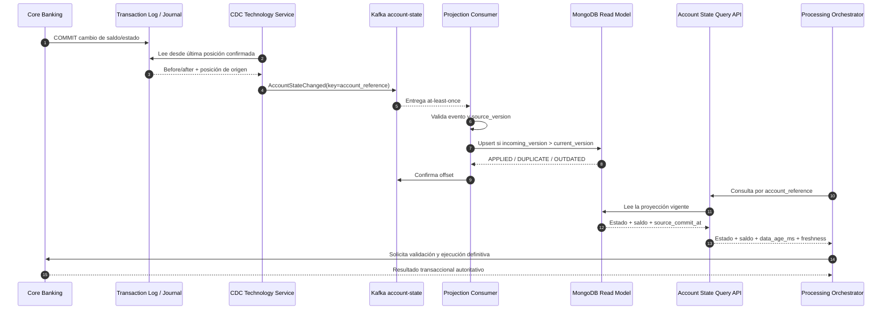
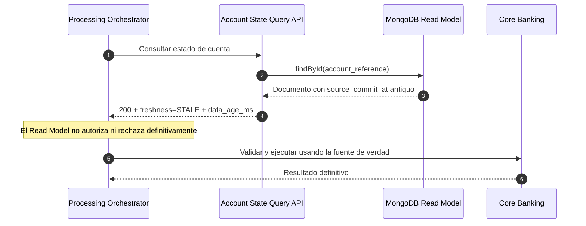

# Propuesta de arquitectura CDC para el Read Model de cuentas

> Documento de diseño técnico — versión `1.0-draft`  
> Fecha: 14 de agosto de 2026  
> Alcance: CDC de saldos y estados de cuentas, Kafka, MongoDB y consulta para validación temprana.

## 1. Resumen ejecutivo

Se propone implementar un flujo de Change Data Capture (CDC) que lea únicamente cambios confirmados en la base de datos del Core Banking, los convierta en eventos canónicos, los publique en Kafka y mantenga en MongoDB una vista de lectura de baja latencia con el saldo y el estado más reciente de cada cuenta.

El `Processing Orchestrator Service` consultará esta vista antes de iniciar una operación para ejecutar una **validación temprana**. El propósito es detectar rápidamente condiciones como cuenta bloqueada, cuenta cerrada o saldo aparentemente insuficiente, reduciendo llamadas innecesarias al Core Banking.

El Read Model CDC tendrá consistencia eventual y, por lo tanto, **no será la fuente de verdad para autorizar o ejecutar un débito**. La validación definitiva seguirá realizándose en el Core Banking dentro de la operación transaccional correspondiente.

La solución deberá proporcionar:

- Captura de cambios confirmados sin modificar la lógica transaccional del Core.
- Entrega `at-least-once` mediante Kafka.
- Orden por cuenta.
- Aplicación idempotente en MongoDB.
- Detección y descarte de duplicados y eventos atrasados.
- Información explícita sobre la frescura del dato.
- Recuperación automática después de interrupciones.
- Reconciliación entre Core Banking y MongoDB.
- Trazabilidad, seguridad y monitoreo de extremo a extremo.

## 2. Contexto

El diagrama general de la solución contiene dos modelos de lectura diferentes:

1. **Transaction Read Model**: consolida el ciclo de vida de una transacción, callback, notificación y auditoría.
2. **CDC Account Read Model**: contiene una copia operativa de saldo y estado de la cuenta proveniente del Core Banking.

Aunque ambos utilizan Kafka y MongoDB, representan dominios, fuentes de datos, controles de seguridad y objetivos de disponibilidad distintos. Por ese motivo se recomienda mantenerlos en servicios, tópicos y colecciones independientes.

### 2.1 Problema que resuelve

Consultar el Core Banking en cada validación temprana puede producir:

- Mayor latencia para el usuario.
- Mayor carga sobre las interfaces y programas del Core.
- Acoplamiento entre la disponibilidad del canal y la disponibilidad del Core.
- Escalamiento más complejo ante picos de solicitudes.

El CDC permite mantener una vista optimizada para lectura sin introducir un `dual write` dentro de las transacciones del Core.

### 2.2 Objetivos

- Exponer saldo y estado de una cuenta con una antigüedad objetivo menor o igual a tres segundos durante operación normal.
- Evitar pérdida de cambios confirmados.
- Permitir relectura y reconstrucción controlada del Read Model.
- Procesar mensajes duplicados sin alterar incorrectamente el estado.
- Evitar que un evento atrasado sobrescriba información más reciente.
- Proporcionar una consulta estable al Orchestrator sin exponer directamente la estructura interna de MongoDB.
- Detectar diferencias mediante un proceso de reconciliación.

### 2.3 Fuera de alcance

- Sustituir al Core Banking como sistema de registro.
- Autorizar definitivamente débitos usando exclusivamente MongoDB.
- Replicar toda la información de la cuenta o del cliente.
- Publicar números de cuenta sin protección o datos personales innecesarios.
- Utilizar el tópico CDC como repositorio regulatorio o como historial contable oficial.
- Resolver reservas concurrentes de fondos exclusivamente mediante el Read Model.

## 3. Principios y decisiones de diseño

1. **El Core Banking continúa siendo la fuente de verdad.**
2. **Solo se capturan cambios confirmados**; un `ROLLBACK` no debe generar un estado visible.
3. **No se implementa dual write** entre la base del Core y Kafka.
4. **La clave Kafka se deriva de una referencia tokenizada de cuenta**, no del número real.
5. **Todos los eventos de una cuenta llegan a la misma partición**, preservando su orden.
6. **El consumidor confirma el offset después de aplicar o descartar correctamente el evento.**
7. **MongoDB aplica actualizaciones condicionales y atómicas.**
8. **Toda respuesta informa la frescura del dato.**
9. **Un dato ausente o desactualizado no equivale automáticamente a una cuenta inexistente o sin saldo.**
10. **Los errores transitorios se reintentan; los errores permanentes se aíslan en una DLQ.**
11. **La reconciliación es obligatoria**, porque CDC no elimina la necesidad de verificar integridad operacional.

## 4. Arquitectura propuesta

```mermaid
flowchart LR
    subgraph CORE["Core Banking"]
        COREAPI["Interfaces del Core"]
        COREDB[("DB / Journal del Core")]
        COREAPI --> COREDB
    end

    subgraph CDCBOUNDARY["CDC Proof of Concept / Servicio CDC"]
        CDCTECH["CDC Technology Service"]
        NORMALIZER["Normalizador de eventos de cuenta"]
        TOPIC[["Kafka: tapp.accounts.state.v1"]]
        CONSUMER["Account State Projection Consumer"]
        MONGO[("CDC Account Read Model - MongoDB")]
        QUERY["Account State Query API"]

        CDCTECH -->|"Cambio confirmado"| NORMALIZER
        NORMALIZER -->|"AccountStateChanged"| TOPIC
        TOPIC -->|"Consume por account_reference"| CONSUMER
        CONSUMER -->|"Upsert idempotente"| MONGO
        QUERY -->|"Lectura"| MONGO
    end

    ORCH["Processing Orchestrator Service"]

    COREDB -->|"Transaction log / journal"| CDCTECH
    ORCH -->|"Validación temprana"| QUERY
    ORCH -->|"Validación definitiva y ejecución"| COREAPI
```



### 4.1 Responsabilidad de cada componente

| Componente | Responsabilidad | No debe hacer |
|---|---|---|
| DB / Journal del Core | Registrar atómicamente los cambios confirmados | Publicar directamente a Kafka mediante lógica de negocio nueva |
| CDC Technology Service | Leer el log o journal desde una posición recuperable | Consultar repetidamente todas las tablas como mecanismo principal |
| Normalizador | Convertir cambios físicos en un contrato canónico y protegido | Exponer nombres de tablas, campos internos o datos sensibles innecesarios |
| Kafka | Desacoplar captura, procesamiento y recuperación | Ser considerado el sistema contable oficial |
| Projection Consumer | Validar, ordenar lógicamente y aplicar eventos | Autorizar transacciones de negocio |
| MongoDB Read Model | Servir lecturas rápidas del estado más reciente | Sustituir a la base transaccional del Core |
| Account State Query API | Encapsular acceso, seguridad y frescura | Permitir acceso general directo a la colección |
| Processing Orchestrator | Usar la vista para una validación temprana | Confiar en un dato atrasado como autorización final |

## 5. Flujo funcional de extremo a extremo

### 5.1 Carga inicial

Antes de consumir cambios continuos debe crearse una imagen inicial consistente:

1. El CDC registra la posición actual del log o journal.
2. Se obtiene un snapshot consistente de las cuentas incluidas en el alcance.
3. El snapshot se publica o carga en MongoDB utilizando el mismo contrato lógico.
4. Se inicia la lectura incremental desde la posición registrada.
5. Se procesan los cambios ocurridos durante la carga inicial.
6. Se compara una muestra o el universo definido contra el Core.
7. El Read Model se marca como disponible únicamente después de superar la validación inicial.

La herramienta CDC seleccionada deberá garantizar que no exista una brecha entre el snapshot y el inicio de la lectura incremental.

### 5.2 Operación continua

1. Una operación modifica saldo o estado en el Core Banking.
2. La base confirma la transacción mediante `COMMIT`.
3. El cambio queda registrado en el log o journal transaccional.
4. El CDC lee el cambio y conserva su posición de origen.
5. El normalizador obtiene la referencia tokenizada de la cuenta y construye el evento canónico.
6. El evento se publica en Kafka usando `account_reference` como clave.
7. Kafka entrega el evento al grupo consumidor del Read Model.
8. El consumidor valida contrato, identidad, versión y campos obligatorios.
9. El consumidor ejecuta un `upsert` atómico condicionado por `source_version`.
10. MongoDB devuelve el resultado: aplicado, duplicado o atrasado.
11. El consumidor confirma el offset cuando el resultado es válido.
12. La métrica de lag end-to-end se calcula usando `source_commit_at` y `applied_at`.

### 5.3 Consulta para validación temprana

1. El Orchestrator recibe una solicitud de transacción.
2. Consulta `Account State Query API` usando la referencia protegida de la cuenta.
3. La API lee MongoDB y calcula `data_age_ms`.
4. Devuelve saldo, estado, moneda, momento del dato y clasificación de frescura.
5. El Orchestrator puede rechazar anticipadamente condiciones inequívocas definidas por negocio.
6. Si el dato está ausente, desactualizado o el Read Model está indisponible, se aplica la política de fallback.
7. Si la operación continúa, el Core Banking vuelve a validar y ejecuta atómicamente.

### 5.4 Secuencia normal



## 6. Consistencia y semántica de entrega

### 6.1 Consistencia eventual

Entre el `COMMIT` del Core y el `upsert` en MongoDB existe una ventana de propagación. Durante esa ventana, una consulta puede devolver el estado anterior. El diseño debe tratar esta condición como normal y observable.

El objetivo de tres segundos debe definirse como un SLO en operación estable, por ejemplo:

- `p95 < 1 segundo`.
- `p99 <= 3 segundos`.
- Cero cambios confirmados perdidos.

Un máximo absoluto de tres segundos no puede garantizarse durante caídas de red, Kafka, MongoDB, mantenimiento o recuperación. En esas condiciones la solución debe detectar el atraso y aplicar fallback, en lugar de devolver silenciosamente un dato como si fuera actual.

### 6.2 Entrega at-least-once

Kafka y la recuperación del CDC pueden entregar un evento más de una vez. Esto se considera esperado. La corrección se consigue mediante idempotencia, no suponiendo entrega exactamente una vez de extremo a extremo.

### 6.3 Orden por cuenta

La clave de todos los eventos relacionados con una cuenta será `account_reference`. Kafka calcula la partición a partir de esa clave, por lo que los eventos de una cuenta mantienen su orden dentro del tópico.

Cambiar el número de particiones modifica la distribución de claves. Ese cambio debe planificarse y probarse; no debe realizarse durante una recuperación sin evaluar el orden y la estrategia de migración.

### 6.4 Versión de origen

Cada evento debe contener:

- `source_position`: posición trazable del journal o log.
- `source_version`: número comparable y monótonamente creciente para cada cuenta.
- `source_transaction_id`: identificador de la transacción de origen cuando esté disponible.

Preferencias para construir `source_version`:

1. Versión de fila proporcionada por el Core.
2. Secuencia del journal transformada en una versión comparable.
3. Versión asignada por el normalizador, persistida de manera durable por cuenta.

No se recomienda utilizar solamente `source_commit_at` para ordenar, porque dos cambios pueden compartir timestamp o llegar con precisión insuficiente.

### 6.5 Regla de aplicación

Para un documento identificado por `account_reference`:

```text
si no existe:
    insertar el documento con source_version entrante

si event_id == last_event_id:
    DUPLICATE; no modificar

si source_version entrante < source_version almacenada:
    OUTDATED; no modificar

si source_version entrante == source_version almacenada
   y event_id != last_event_id:
    VERSION_CONFLICT; enviar a DLQ y alertar

si source_version entrante > source_version almacenada:
    actualizar atómicamente y devolver APPLIED
```

El filtro de versión y la actualización deben ejecutarse en una única operación de MongoDB. Un `find` seguido de un `save` permitiría carreras entre consumidores o reintentos.

## 7. Diseño de Kafka

### 7.1 Tópicos

| Propósito | Nombre propuesto |
|---|---|
| Eventos principales | `tapp.accounts.state.v1` |
| Reintentos transitorios | `tapp.accounts.state.v1.retry` |
| Dead Letter Queue | `tapp.accounts.state.v1.dlq` |

Si la plataforma corporativa tiene una convención distinta, los nombres deberán adaptarse sin cambiar la semántica.

### 7.2 Configuración conceptual

- Key: `account_reference` tokenizada.
- Particiones: determinadas después de medir TPS, tamaño de eventos y tiempo de procesamiento.
- Replicación: de acuerdo con el estándar corporativo; para producción se recomienda tolerancia a la pérdida de un broker.
- `acks`: política corporativa de durabilidad, preferentemente confirmación de réplicas en sincronía.
- Compresión: habilitada si el estándar y las mediciones lo justifican.
- Retención: suficiente para cubrir el tiempo máximo de recuperación y reconstrucción acordado.
- Compactación: recomendable para conservar el último estado por cuenta, sin considerar el tópico como historial regulatorio.
- Schema Registry: recomendable para compatibilidad y gobierno de contratos.

### 7.3 Grupo consumidor

Nombre sugerido:

```text
account_state_projection_service_v1
```

La cantidad máxima de consumidores activos procesando en paralelo está limitada por el número de particiones. Las instancias adicionales quedarán disponibles para failover.

## 8. Contrato del evento

### 8.1 Evento canónico recomendado

Kafka key:

```text
tok_account_7f89a2
```

Payload:

```json
{
  "payload": {
    "account_reference": "tok_account_7f89a2",
    "event_type": "AccountStateChanged",
    "source_version": 8421,
    "status": "ACTIVE",
    "currency": "PEN",
    "available_balance": "850.00",
    "ledger_balance": "900.00"
  },
  "metadata": {
    "event_id": "DB2I-JRN-000008421",
    "schema_version": "1.0",
    "source_system": "TAPP_CORE",
    "source_table": "PROTECTED_LOGICAL_NAME",
    "source_transaction_id": "CORE-TX-591002",
    "source_position": "JRNRCV01:000008421",
    "source_commit_at": "2026-08-14T15:10:05.120Z",
    "captured_at": "2026-08-14T15:10:05.310Z",
    "published_at": "2026-08-14T15:10:05.480Z",
    "correlation_id": "d269926e-4e93-4405-9350-f0b39c85b853",
    "trace_id": "41d23e9fb0554d2a",
    "retry_count": 0
  }
}
```

Los nombres físicos de tablas no deberían publicarse si revelan detalles internos. `source_table` puede contener un nombre lógico protegido o eliminarse del contrato público y conservarse solamente en logs restringidos.

### 8.2 Definición de campos

| Campo | Obligatorio | Descripción |
|---|---:|---|
| `payload.account_reference` | Sí | Identificador tokenizado o cifrado determinísticamente |
| `payload.event_type` | Sí | Tipo de evento canónico |
| `payload.source_version` | Sí | Versión monotónica por cuenta |
| `payload.status` | Sí | Estado canónico de la cuenta |
| `payload.currency` | Sí | Código ISO de tres letras |
| `payload.available_balance` | Sí | Saldo disponible expresado como decimal textual |
| `payload.ledger_balance` | Según alcance | Saldo contable expresado como decimal textual |
| `metadata.event_id` | Sí | Identidad global para idempotencia y trazabilidad |
| `metadata.schema_version` | Sí | Versión del contrato |
| `metadata.source_system` | Sí | Sistema de origen |
| `metadata.source_transaction_id` | Recomendado | Transacción que produjo el cambio |
| `metadata.source_position` | Sí | Posición recuperable del log o journal |
| `metadata.source_commit_at` | Sí | Momento del `COMMIT` en origen |
| `metadata.captured_at` | Sí | Momento de captura por CDC |
| `metadata.published_at` | Sí | Momento de publicación en Kafka |
| `metadata.correlation_id` | Sí | Correlación operativa |
| `metadata.trace_id` | Recomendado | Trazabilidad distribuida |
| `metadata.retry_count` | Sí | Número de reintento, inicialmente cero |

### 8.3 Estado completo frente a cambios parciales

Se recomienda que el evento canónico contenga el estado completo necesario para la consulta. Esto simplifica reconstrucción, compactación e idempotencia.

Si saldo y estado provienen de tablas distintas, existen dos opciones:

1. El normalizador mantiene un estado técnico y emite una imagen canónica completa.
2. Se publican eventos parciales como `AccountBalanceChanged` y `AccountStatusChanged`, y el consumidor actualiza únicamente los campos presentes.

La primera opción produce un contrato de lectura más simple. La segunda reduce trabajo del normalizador, pero aumenta el riesgo de observar temporalmente campos correspondientes a posiciones diferentes. La decisión depende del diseño real del Core y debe cerrarse durante el PoC.

### 8.4 Evolución del contrato

- Cambios compatibles agregan campos opcionales.
- No se cambia el significado de un campo existente.
- No se reutiliza un valor de catálogo con otra semántica.
- Un cambio incompatible utiliza una nueva versión de esquema y, cuando corresponda, un nuevo tópico.
- Productor y consumidor deben pasar pruebas de contrato antes de desplegar.
- Los eventos desconocidos no deben aplicarse parcialmente sin una regla explícita.

## 9. Modelo de datos en MongoDB

### 9.1 Colección

Nombre propuesto:

```text
account_state_projection
```

Documento de ejemplo:

```json
{
  "_id": "tok_account_7f89a2",
  "account_reference": "tok_account_7f89a2",
  "status": "ACTIVE",
  "currency": "PEN",
  "available_balance": { "$numberDecimal": "850.00" },
  "ledger_balance": { "$numberDecimal": "900.00" },
  "source_version": 8421,
  "source_position": "JRNRCV01:000008421",
  "source_transaction_id": "CORE-TX-591002",
  "last_event_id": "DB2I-JRN-000008421",
  "source_commit_at": { "$date": "2026-08-14T15:10:05.120Z" },
  "captured_at": { "$date": "2026-08-14T15:10:05.310Z" },
  "published_at": { "$date": "2026-08-14T15:10:05.480Z" },
  "applied_at": { "$date": "2026-08-14T15:10:05.650Z" },
  "created_at": { "$date": "2026-08-01T14:00:00.000Z" },
  "updated_at": { "$date": "2026-08-14T15:10:05.650Z" }
}
```

Los saldos deben persistirse como `Decimal128` o el tipo decimal corporativo equivalente. No deben utilizarse `float` o `double`.

### 9.2 Índices

Índices mínimos:

```javascript
db.account_state_projection.createIndex(
  { account_reference: 1 },
  { unique: true, name: "uk_account_reference" }
)

db.account_state_projection.createIndex(
  { source_commit_at: 1 },
  { name: "ix_source_commit_at" }
)

db.account_state_projection.createIndex(
  { status: 1 },
  { name: "ix_status", sparse: true }
)
```

El índice por `status` solo debe crearse si existe un caso de consulta real. Los índices incrementan el costo de escritura y almacenamiento; no deben agregarse por anticipación sin una necesidad medida.

### 9.3 Retención

La colección representa cuentas vigentes y no debería tener un TTL general. La eliminación de cuentas cerradas debe seguir una política explícita de retención, privacidad y auditoría.

Si se requiere guardar eventos técnicos para diagnóstico, deben almacenarse en otra colección con retención controlada. El documento principal no debe crecer acumulando un historial ilimitado.

## 10. API de consulta

### 10.1 Motivo de la API

Para el PoC puede realizarse una consulta técnica directa a MongoDB. Para producción se recomienda un servicio de consulta porque:

- Evita acoplar el Orchestrator al esquema físico.
- Centraliza autenticación y autorización.
- Calcula la frescura de forma consistente.
- Permite evolucionar MongoDB sin cambiar consumidores.
- Aplica rate limit, auditoría y protección de campos.
- Entrega métricas de disponibilidad y latencia.

### 10.2 Endpoint propuesto

```http
GET /v1/accounts/{account_reference}/state
```

Respuesta:

```json
{
  "account_reference": "tok_account_7f89a2",
  "status": "ACTIVE",
  "currency": "PEN",
  "available_balance": "850.00",
  "ledger_balance": "900.00",
  "source_version": 8421,
  "source_commit_at": "2026-08-14T15:10:05.120Z",
  "read_at": "2026-08-14T15:10:06.010Z",
  "data_age_ms": 890,
  "freshness": "FRESH"
}
```

Valores de `freshness`:

- `FRESH`: antigüedad dentro del umbral acordado.
- `STALE`: existe un documento, pero supera el umbral.
- `UNKNOWN`: no puede determinarse la antigüedad de manera confiable.

Respuestas HTTP sugeridas:

| Código | Significado |
|---:|---|
| `200` | Estado encontrado; revisar siempre `freshness` |
| `400` | Referencia o solicitud inválida |
| `401/403` | No autenticado o no autorizado |
| `404` | No existe en el Read Model; no prueba inexistencia en el Core |
| `429` | Límite de solicitudes excedido |
| `503` | Read Model o dependencia no disponible |

### 10.3 Política del Orchestrator

La decisión exacta debe acordarse con Riesgos y Negocio. Propuesta base:

| Condición | Acción temprana | Acción definitiva |
|---|---|---|
| `FRESH` y cuenta bloqueada/cerrada | Rechazar según regla aprobada | No ejecutar |
| `FRESH` y saldo aparentemente insuficiente | Rechazar o continuar según política de sobregiro | Core conserva autoridad final |
| `FRESH` y condiciones válidas | Continuar | Validar y ejecutar en Core |
| `STALE` | No confiar en saldo/estado para rechazo definitivo | Consultar o ejecutar contra Core |
| `404` | No asumir cuenta inexistente | Consultar Core |
| `503` | Aplicar fallback | Core o respuesta controlada según criticidad |

### 10.4 Flujo cuando el dato está atrasado



## 11. Manejo de errores y recuperación

### 11.1 Clasificación de errores

**Errores transitorios:**

- Timeout o indisponibilidad temporal de MongoDB.
- Error temporal de red.
- Rebalance del consumidor.
- Indisponibilidad recuperable de Kafka.
- Saturación temporal de una dependencia.

Estos errores deben reintentarse con backoff, jitter y un máximo configurable. Si la plataforma lo permite, el consumidor puede pausar la partición para conservar orden.

**Errores permanentes:**

- Contrato inválido.
- Campo obligatorio ausente.
- Referencia de cuenta no protegida o con formato inválido.
- Catálogo no reconocido sin compatibilidad definida.
- Misma `source_version` con distinto `event_id`.
- Importe no convertible a decimal.

Estos eventos deben enviarse a DLQ con contexto suficiente y sin registrar datos sensibles en texto abierto.

### 11.2 Matriz de fallos

| Escenario | Comportamiento esperado | Recuperación |
|---|---|---|
| CDC detenido | El Read Model envejece y se activa alerta | Reanudar desde la última posición durable |
| Retención del journal agotada | No puede continuar de forma segura | Nuevo snapshot y reconciliación completa |
| Kafka no disponible | CDC reintenta o mantiene posición sin perder el origen | Reanudar publicación al recuperar conectividad |
| Consumer detenido | Aumenta consumer lag | Reanudar desde offsets confirmados |
| MongoDB no disponible | No confirmar offsets no aplicados | Reintentar con backoff y recuperar backlog |
| Evento duplicado | No-op y métrica de duplicado | Confirmar offset |
| Evento atrasado | No-op y métrica de evento atrasado | Confirmar offset |
| Conflicto de versión | No aplicar | DLQ, alerta e investigación |
| Mensaje inválido | No aplicar | DLQ y corrección del productor/normalizador |
| Diferencia en reconciliación | Marcar inconsistencia | Reparar documento o reconstruir alcance afectado |

### 11.3 DLQ

La DLQ deberá conservar:

- Evento original protegido.
- Tópico, partición y offset originales.
- Consumer group.
- Código y tipo de error.
- Primer y último momento de fallo.
- Cantidad de reintentos.
- Servicio que detectó el error.
- `correlation_id`, `trace_id`, `event_id` y `source_position`.

El proceso de replay debe:

1. Exigir que la causa esté corregida.
2. Mantener la misma clave de cuenta.
3. Preservar la identidad y versión de origen.
4. Registrar quién autorizó y ejecutó el replay.
5. Ser idempotente.
6. Validar posteriormente el documento contra el Core.

## 12. Reconciliación

CDC reduce el desfase, pero no reemplaza el control de integridad. Se propone un proceso separado de reconciliación:

1. Seleccionar cuentas modificadas dentro de una ventana.
2. Obtener una imagen autoritativa mediante una interfaz aprobada del Core.
3. Comparar referencia, estado, moneda y saldos.
4. Clasificar diferencias por antigüedad y severidad.
5. Ignorar temporalmente diferencias dentro de la ventana normal de propagación.
6. Generar alerta cuando la diferencia persiste.
7. Reparar mediante un evento de corrección versionado o reconstrucción controlada.
8. Mantener evidencia de la comparación y la reparación.

Frecuencias sugeridas para evaluar en el PoC:

- Muestreo frecuente para detección temprana.
- Reconciliación incremental de cuentas modificadas.
- Reconciliación completa con periodicidad acordada según volumen y criticidad.

No debe realizarse una escritura silenciosa en MongoDB sin registrar la causa y la posición de corrección.

## 13. Seguridad

### 13.1 Identidad y datos

- No publicar el número real de cuenta como Kafka key, `_id`, log o métrica.
- Utilizar tokenización o cifrado determinístico aprobado.
- Publicar exclusivamente los campos necesarios para la validación temprana.
- Evitar nombres, documentos de identidad, dirección, teléfono u otros datos del cliente.
- Enmascarar o eliminar payloads en logs de aplicación.
- Definir clasificación de saldo y estado como datos sensibles.

### 13.2 Acceso al origen

- El usuario CDC tendrá privilegios de solo lectura sobre el log o journal requerido.
- No tendrá permisos para modificar tablas del Core.
- Las credenciales se almacenarán en el gestor corporativo de secretos.
- La rotación no deberá requerir reconstruir el Read Model.
- Los accesos y cambios de configuración se auditarán.

### 13.3 Comunicación y almacenamiento

- TLS/mTLS según estándar corporativo entre CDC, Kafka, consumidor, MongoDB y API.
- ACL de Kafka por tópico y consumer group.
- Cifrado en reposo para Kafka y MongoDB.
- Autenticación fuerte de servicios.
- Autorización de mínimo privilegio.
- Segmentación de red y allowlists.
- Integración con HSM/KMS cuando la política de tokenización o cifrado lo requiera.

### 13.4 Auditoría

Registrar sin exponer información sensible:

- Identidad técnica del servicio.
- Operación realizada.
- Referencia protegida.
- `event_id`, versión y posición de origen.
- Resultado `APPLIED`, `DUPLICATE`, `OUTDATED` o `FAILED`.
- Tópico, partición y offset.
- Latencia y trace de extremo a extremo.

## 14. Observabilidad

### 14.1 Métricas mínimas

| Métrica | Propósito |
|---|---|
| `cdc_capture_lag_seconds` | Tiempo desde el `COMMIT` hasta la captura |
| `cdc_publish_lag_seconds` | Tiempo desde captura hasta Kafka |
| `kafka_consumer_lag_records` | Registros pendientes por partición |
| `projection_apply_duration_seconds` | Latencia del consumidor y MongoDB |
| `end_to_end_lag_seconds` | Tiempo desde `source_commit_at` hasta `applied_at` |
| `projection_applied_total` | Eventos aplicados |
| `projection_duplicate_total` | Duplicados ignorados |
| `projection_outdated_total` | Eventos atrasados ignorados |
| `projection_version_conflict_total` | Conflictos de versión |
| `projection_dlq_total` | Mensajes enviados a DLQ |
| `read_model_query_duration_seconds` | Latencia de la API |
| `read_model_stale_response_total` | Respuestas con información atrasada |
| `reconciliation_mismatch_total` | Diferencias con el Core |

### 14.2 Logs

Los logs deben ser estructurados y contener:

- `event_id`.
- `account_reference` protegida.
- `source_version`.
- `source_position`.
- `correlation_id`.
- `trace_id`.
- Tópico, partición y offset.
- Resultado de procesamiento.
- Duración.
- Código de error sanitizado.

No se debe registrar el payload completo en producción por defecto.

### 14.3 Alertas iniciales

- Lag end-to-end por encima de tres segundos durante una ventana acordada.
- Ausencia de eventos CDC cuando existen cambios en el origen.
- Crecimiento sostenido del consumer lag.
- DLQ mayor que cero.
- Conflictos de versión.
- Read Model con porcentaje elevado de respuestas `STALE`.
- Errores o latencia de MongoDB por encima del umbral.
- Diferencias persistentes de reconciliación.
- Posición CDC cercana a vencer por retención del journal.

Los umbrales definitivos deben establecerse con una línea base de carga real.

## 15. Escalabilidad y disponibilidad

### 15.1 Particionamiento

La cantidad de particiones se calcula con:

- TPS pico del Core.
- Tamaño promedio y máximo del evento.
- Tiempo promedio y p99 del `upsert`.
- Capacidad de cada instancia consumidora.
- Crecimiento esperado.
- Tiempo máximo permitido para recuperar backlog.

Todos los cambios de una cuenta deben conservar la misma clave.

### 15.2 Consumer

- Varias instancias dentro del mismo consumer group.
- Una partición activa en una sola instancia del grupo.
- Procesamiento con backpressure.
- Timeouts y pool de conexiones dimensionados.
- Pausa controlada ante fallos de MongoDB para evitar ciclos agresivos de reintento.
- Health checks separados para proceso vivo, listo y dependencias.

### 15.3 MongoDB

- Replica set para alta disponibilidad.
- Write concern alineado con el riesgo de pérdida aceptable.
- Read preference consistente con la frescura requerida.
- Capacidad de disco considerando índices y crecimiento.
- Sharding únicamente si las mediciones lo exigen; `account_reference` puede evaluarse como shard key.
- Backups y restauraciones probadas.

### 15.4 Kafka y CDC

- Replicación y min ISR según estándar corporativo.
- Posiciones CDC almacenadas de forma durable.
- Retención del log de origen superior al peor tiempo de indisponibilidad recuperable.
- Estrategia activa/pasiva del CDC si el producto no soporta múltiples lectores coordinados.
- Evitar dos productores CDC activos publicando sin una identidad y deduplicación deterministas.

## 16. Configuración sugerida

Variables conceptuales del servicio consumidor/API:

```text
KAFKA_BOOTSTRAP_SERVERS
KAFKA_TOPIC_ACCOUNT_STATE=tapp.accounts.state.v1
KAFKA_TOPIC_ACCOUNT_STATE_RETRY=tapp.accounts.state.v1.retry
KAFKA_TOPIC_ACCOUNT_STATE_DLQ=tapp.accounts.state.v1.dlq
KAFKA_CONSUMER_GROUP=account_state_projection_service_v1
MONGODB_URI
MONGODB_DATABASE=tapp_account_read_model
MONGODB_COLLECTION=account_state_projection
READ_MODEL_FRESHNESS_THRESHOLD_MS=3000
PROJECTION_MAX_RETRIES=3
PROJECTION_RETRY_BACKOFF_MS=2000
QUERY_TIMEOUT_MS
CORE_FALLBACK_ENABLED
```

Los secretos no deben entregarse mediante valores fijos en repositorio. Los valores por ambiente deben administrarse mediante la plataforma de configuración y secretos correspondiente.

## 17. Pruebas

### 17.1 Pruebas unitarias

- Validación de contrato.
- Conversión de importes a decimal.
- Mapeo de estados del Core al catálogo canónico.
- Cálculo de frescura.
- Clasificación de duplicado, atrasado y conflicto.
- Reglas de fallback.
- Sanitización de logs.

### 17.2 Pruebas de contrato

- Productor CDC contra esquema AsyncAPI/Avro/JSON Schema.
- Consumer contra versiones compatibles.
- Rechazo de campos o catálogos inválidos.
- Compatibilidad hacia atrás al agregar campos opcionales.

### 17.3 Pruebas de integración

- Kafka real o contenedorizado.
- MongoDB real o contenedorizado.
- `upsert` atómico bajo concurrencia.
- Reinicio antes y después de confirmar offset.
- Retry y DLQ.
- Rebalance con varias instancias.
- Replay desde offsets anteriores.

### 17.4 Pruebas de resiliencia

- Detener MongoDB mientras llegan eventos.
- Detener una instancia consumidora.
- Interrumpir conectividad con Kafka.
- Reiniciar CDC desde la última posición.
- Entregar duplicados.
- Entregar versiones desordenadas.
- Agotar temporalmente el pool de conexiones.
- Acumular backlog y medir tiempo de recuperación.
- Simular pérdida de posición y ejecutar snapshot controlado.

### 17.5 Pruebas de rendimiento

- TPS promedio y pico.
- Burst superior al pico esperado.
- Eventos con tamaño máximo permitido.
- p95 y p99 de captura, publicación, aplicación y consulta.
- Capacidad de recuperación de backlog.
- Impacto de índices MongoDB.
- Impacto del proceso CDC sobre el Core.

### 17.6 Pruebas de reconciliación

- Documento idéntico al Core.
- Saldo diferente.
- Estado diferente.
- Documento ausente.
- Documento adicional.
- Diferencia todavía dentro de la ventana de propagación.
- Reparación y evidencia posterior.

## 18. Plan del Proof of Concept

### Fase 0: decisiones y preparación

- Confirmar tecnología y capacidades CDC disponibles para la base real.
- Identificar tablas, journal, claves y operaciones relevantes.
- Definir significado exacto de saldo disponible y saldo contable.
- Definir catálogo de estados.
- Acordar tokenización de cuenta.
- Medir TPS y volumen.
- Acordar la política frente a datos `STALE`.

### Fase 1: captura

- Crear usuario CDC de mínimo privilegio.
- Configurar lectura del log o journal.
- Persistir posición de captura.
- Ejecutar snapshot inicial.
- Demostrar captura de `INSERT`, `UPDATE`, `DELETE` y `ROLLBACK` cuando apliquen.
- Confirmar que un `ROLLBACK` no se publica como estado válido.

### Fase 2: contrato y Kafka

- Implementar normalización.
- Crear esquema de evento.
- Crear tópico principal, retry y DLQ.
- Publicar con clave protegida.
- Verificar orden de varios cambios sobre una cuenta.

### Fase 3: proyección MongoDB

- Crear colección e índices.
- Implementar validación e idempotencia.
- Implementar `upsert` condicional por versión.
- Confirmar offsets únicamente después del resultado válido.
- Implementar métricas y logs.

### Fase 4: consulta

- Implementar Account State Query API.
- Calcular `data_age_ms` y `freshness`.
- Integrar con el Orchestrator en modo de observación.
- Comparar la respuesta con el resultado definitivo del Core.

### Fase 5: resiliencia y reconciliación

- Ejecutar escenarios de caída.
- Verificar recuperación automática.
- Generar duplicados y eventos desordenados.
- Probar DLQ y replay.
- Ejecutar reconciliación y reparación controlada.

### Fase 6: evidencias y decisión

- Reportar p50, p95 y p99 de lag.
- Reportar throughput máximo sostenible.
- Reportar recuperación de backlog.
- Documentar impacto sobre el Core.
- Documentar diferencias encontradas.
- Cerrar riesgos y decisiones pendientes.
- Emitir recomendación `go`, `go con condiciones` o `no-go`.

## 19. Criterios de aceptación del PoC

| Categoría | Criterio propuesto |
|---|---|
| Integridad | Cero cambios confirmados perdidos en los casos de prueba |
| Rollback | Ningún cambio revertido visible como estado final |
| Idempotencia | Duplicados no alteran el resultado |
| Orden | Eventos atrasados no sobrescriben estados recientes |
| Latencia | p99 end-to-end menor o igual a tres segundos en carga acordada |
| Recuperación | Reinicio desde posición/offset sin intervención sobre datos |
| Backlog | Recuperación dentro del tiempo objetivo definido |
| Consulta | Respuesta incluye momento del dato, antigüedad y frescura |
| Seguridad | No se exponen números reales de cuenta ni payloads sensibles en logs |
| DLQ | Mensaje inválido queda aislado con contexto y puede reprocesarse |
| Reconciliación | Diferencias se detectan y existe procedimiento de corrección |
| Core | Impacto de lectura CDC dentro del límite aprobado |

El volumen de carga, duración de la prueba y percentiles definitivos deberán incluirse en el acta del PoC para que el resultado sea reproducible.

## 20. Estrategia de adopción

### Etapa 1: shadow mode

- El Orchestrator consulta el Read Model.
- No toma decisiones de negocio basadas en la respuesta.
- Se compara saldo/estado CDC con el Core.
- Se mide lag, disponibilidad y tasa de diferencias.

### Etapa 2: validación temprana informativa

- Se utilizan datos `FRESH` para observabilidad y optimización.
- Las decisiones definitivas continúan siempre en el Core.
- Se monitorean falsos positivos y falsos negativos.

### Etapa 3: rechazo temprano controlado

- Solo se habilitan reglas aprobadas por Negocio y Riesgos.
- Se activa por feature flag y segmento.
- Existe rollback inmediato a consulta/ejecución directa en Core.
- Se conserva evidencia de la regla aplicada y la frescura observada.

### Etapa 4: operación completa

- SLO y alertas formalizados.
- Runbooks aprobados.
- Reconciliación automatizada.
- DR probado.
- Capacidad validada para el pico esperado.

## 21. Relación con el repositorio actual

Este repositorio implementa actualmente el **Transaction Projection / Read Model** que consume `tapp.transaction.projection.v1` y mantiene `transaction_projection` en MongoDB.

Se pueden reutilizar como referencia los siguientes patrones:

- Consumidor Kafka con retry y DLQ.
- Validación de Kafka key.
- Idempotencia por `event_id`.
- Orden lógico por versión.
- `upsert` condicional y atómico en MongoDB.
- Clasificación `APPLIED`, `DUPLICATE` y `OUTDATED`.
- Arquitectura hexagonal con puertos de entrada y salida.
- Pruebas unitarias y de adaptadores.

Sin embargo, no se recomienda mezclar ambos modelos en el mismo tópico o colección.

### 21.1 Recomendación de separación

Crear un servicio o módulo desplegable independiente, por ejemplo:

```text
bhxw-tapp-account-state-read-model
```

Motivos:

- La fuente es el log del Core y no el Outbox transaccional de TAPP.
- El contrato contiene datos de cuenta y requiere controles de seguridad distintos.
- El SLO de frescura es diferente.
- La retención y reconstrucción son diferentes.
- Puede requerir escalamiento y operación independientes.
- Una falla en la proyección de transacciones no debe detener el CDC de cuentas y viceversa.

### 21.2 Alternativa temporal para el PoC

Si por velocidad se implementa dentro del mismo código base, debe mantenerse separación explícita:

```text
accountstate/domain
accountstate/application
accountstate/adapters/kafka
accountstate/adapters/repository
accountstate/adapters/api
```

También deberán existir:

- Configuración Kafka independiente.
- Consumer group independiente.
- Colección MongoDB independiente.
- Métricas y dashboards independientes.
- Feature flag para evitar impacto sobre el flujo transaccional existente.

La separación lógica dentro del mismo repositorio no implica que deba desplegarse en el mismo proceso para producción.

## 22. Decisiones pendientes

Antes de cerrar el diseño deberán resolverse las siguientes preguntas:

1. ¿Qué tecnología CDC está aprobada para la base y journal reales?
2. ¿Saldo y estado se encuentran en una tabla o en varias?
3. ¿Existe una versión de fila confiable por cuenta?
4. ¿Cómo se construye una `source_version` comparable a partir del journal?
5. ¿Cuál es la definición oficial de saldo disponible?
6. ¿Cómo se representan sobregiros, fondos retenidos y saldos bloqueados?
7. ¿Cuál es el catálogo canónico de estados de cuenta?
8. ¿Quién genera la referencia tokenizada y cómo se rota la llave?
9. ¿Cuál es la política exacta del Orchestrator para `STALE`, `404` y `503`?
10. ¿El objetivo de tres segundos aplica a p95, p99 o al 100 % en operación estable?
11. ¿Cuánto tiempo se conserva el journal de origen?
12. ¿Cuánto backlog debe poder recuperar la plataforma y en qué tiempo?
13. ¿Qué RPO y RTO se requieren?
14. ¿Cuál es la periodicidad y universo de reconciliación?
15. ¿Se utilizará Schema Registry y qué formato de contrato está aprobado?
16. ¿Cuál será la política de compactación y retención de Kafka?
17. ¿Qué datos pueden persistirse de acuerdo con seguridad, privacidad y regulación?
18. ¿Qué equipo será responsable del replay de la DLQ y de la reparación de diferencias?

## 23. Riesgos principales y mitigaciones

| Riesgo | Impacto | Mitigación |
|---|---|---|
| Utilizar saldo desactualizado como autorización | Débito rechazado o aprobado incorrectamente | Validación definitiva en Core y frescura explícita |
| Pérdida de posición CDC | Brecha de datos | Posición durable, monitoreo de retención y snapshot controlado |
| Eventos duplicados | Actualización repetida | `event_id` y `upsert` idempotente |
| Eventos fuera de orden | Sobrescritura con estado antiguo | Key por cuenta y condición por `source_version` |
| Diferencias no detectadas | Read Model incorrecto durante largo tiempo | Reconciliación y alertas |
| Exposición del número de cuenta | Incidente de seguridad | Tokenización, cifrado y minimización |
| Acoplamiento directo a MongoDB | Cambios costosos y accesos difíciles de gobernar | Account State Query API |
| Crecimiento del lag | Validaciones tempranas poco confiables | SLO, backpressure, escalamiento y fallback |
| Retención Kafka insuficiente | Reconstrucción incompleta | Dimensionar retención y mantener snapshot/reconciliación |
| Dos capturadores activos sin coordinación | Duplicados o desorden operacional | Liderazgo activo/pasivo e identidad determinista |

## 24. Runbook operacional mínimo

### Cuando aumenta el lag

1. Determinar si el atraso se origina en CDC, Kafka, consumidor o MongoDB.
2. Verificar salud y posición del journal.
3. Revisar consumer lag por partición.
4. Revisar latencia y errores de MongoDB.
5. Confirmar que las respuestas de API estén marcándose `STALE`.
6. Activar o verificar el fallback del Orchestrator.
7. Escalar consumidores únicamente si existen particiones disponibles.
8. Medir la velocidad de recuperación del backlog.
9. Ejecutar reconciliación al normalizarse.

### Cuando existen mensajes en DLQ

1. Bloquear replay automático sin diagnóstico.
2. Clasificar error de contrato, datos, versión o infraestructura.
3. Corregir la causa.
4. Verificar que el evento no contenga datos no permitidos.
5. Autorizar el replay.
6. Reprocesar preservando key, identidad y versión.
7. Comparar el documento final con el Core.

### Cuando se pierde la posición CDC

1. Detener publicación para evitar una mezcla no controlada.
2. Determinar el último punto verificable.
3. Evaluar si el journal todavía conserva la posición.
4. Si no la conserva, ejecutar un nuevo snapshot.
5. Reiniciar desde una posición coordinada.
6. Reconciliar todo el alcance afectado.
7. Documentar la ventana y evidencia de recuperación.

## 25. Conclusión

La propuesta utiliza CDC para desacoplar las consultas tempranas del Core Banking y construir una vista de cuenta rápida y escalable. La corrección depende de cuatro controles fundamentales: captura solo después del `COMMIT`, orden por cuenta, aplicación idempotente por versión y validación definitiva en el Core.

El objetivo de lag menor o igual a tres segundos es alcanzable como SLO de operación normal, siempre que se mida de extremo a extremo y exista una política explícita para datos atrasados. El PoC debe demostrar no solo velocidad, sino también recuperación, ausencia de pérdida, seguridad, reconciliación y comportamiento bajo fallos.

La recomendación final es desplegar el CDC Account Read Model como un servicio independiente del Transaction Read Model existente, reutilizando sus patrones técnicos comprobados, pero sin mezclar contratos, colecciones ni responsabilidades de dominio.

## 26. Glosario

| Término | Definición |
|---|---|
| CDC | Change Data Capture; captura de cambios desde el log transaccional |
| Read Model | Vista optimizada para consultas |
| Core Banking | Sistema autoritativo que valida y registra la operación |
| Journal/transaction log | Registro durable de cambios de la base |
| Kafka key | Clave usada para asignar partición y conservar orden |
| Consumer group | Grupo coordinado de instancias consumidoras |
| Offset | Posición de un mensaje dentro de una partición Kafka |
| DLQ | Tópico que aísla mensajes no procesables |
| Idempotencia | Propiedad que permite repetir una operación sin alterar el resultado correcto |
| `source_version` | Versión monotónica utilizada para evitar sobrescrituras atrasadas |
| `source_position` | Posición trazable y recuperable dentro del log o journal |
| SLO | Objetivo medible de nivel de servicio |
| RPO | Máxima pérdida de datos tolerada |
| RTO | Tiempo objetivo de recuperación |
| `FRESH` | Dato dentro del umbral de antigüedad |
| `STALE` | Dato existente que supera el umbral de antigüedad |
